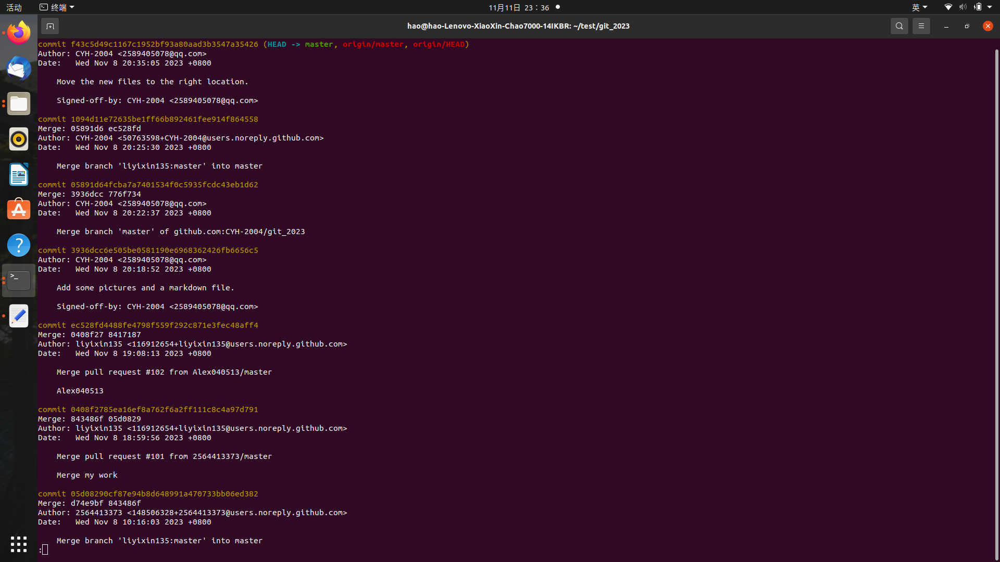
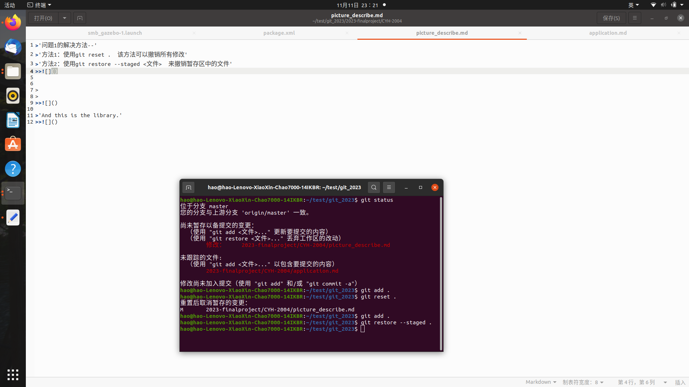
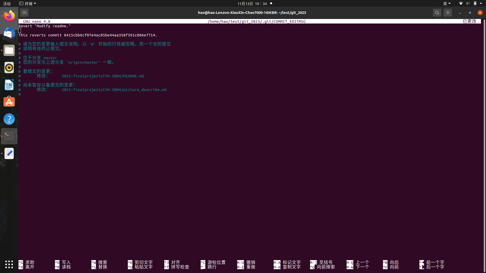
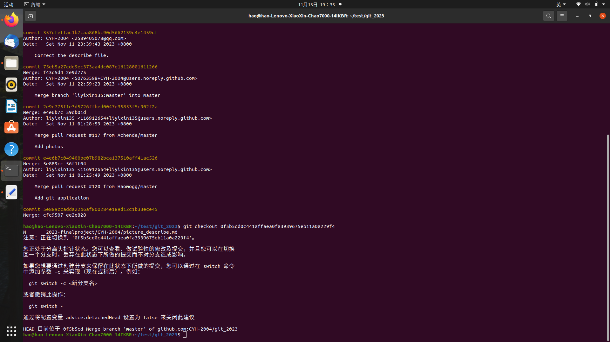
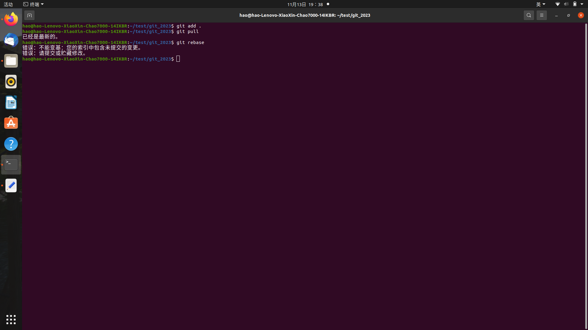
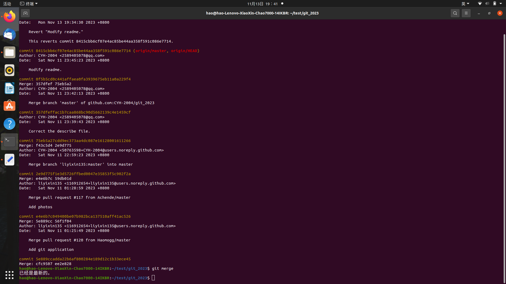

>'图片引用'
>>

>'问题1的解决方法--'
>'方法1：使用git reset .  该方法可以撤销所有修改'
>'方法2：使用git restore --staged <文件>  来撤销暂存区中的文件'
>>

>'问题2的解决方法--'
>'1.改变历史的方法：git revert HEAD'
>'2.不改变历史的方法：git checkout <commit-hash>'
>>
>>
>'问题3的解决方法--'
>'由于编写该文件时已经提交之前的更改，故未能截屏完整操作过程'
>'方法1：切换到master分支后，先使用git pull，随后再使用git rebase'
>>
>'方法2：使用git merge'
>>
