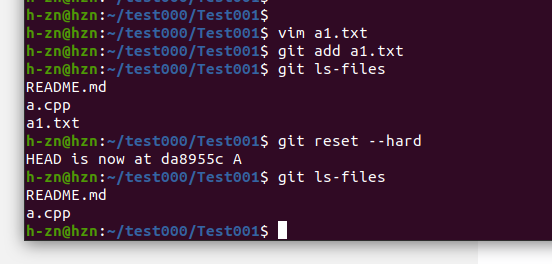
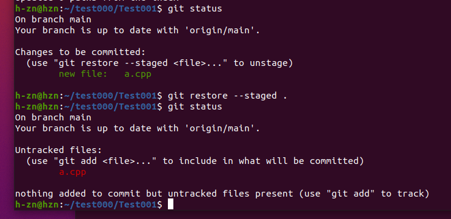
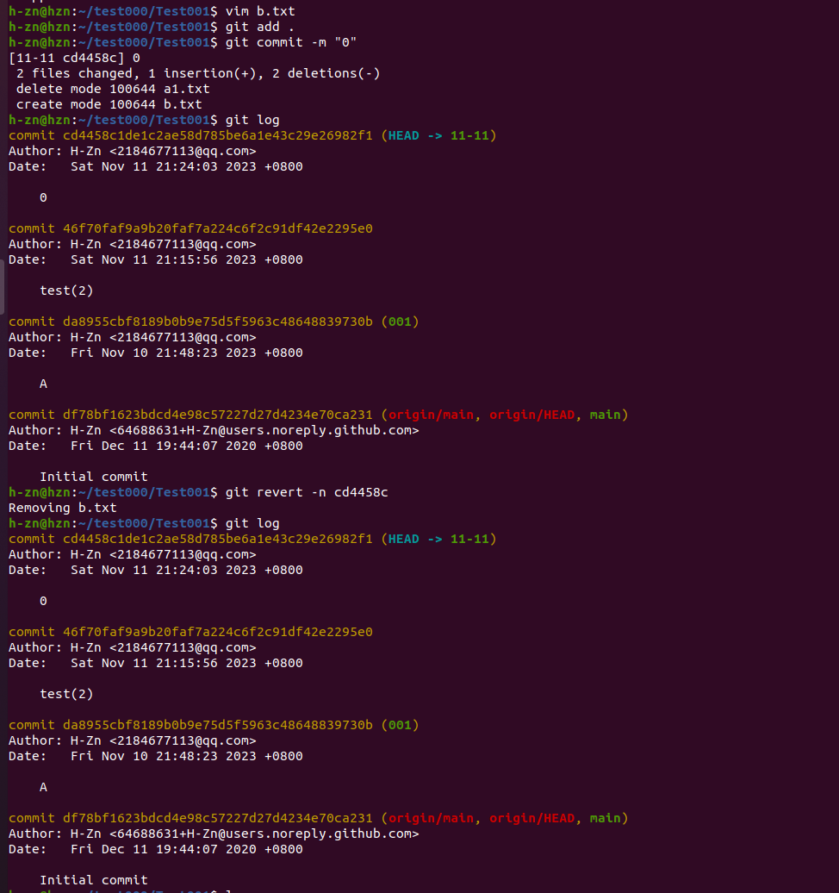
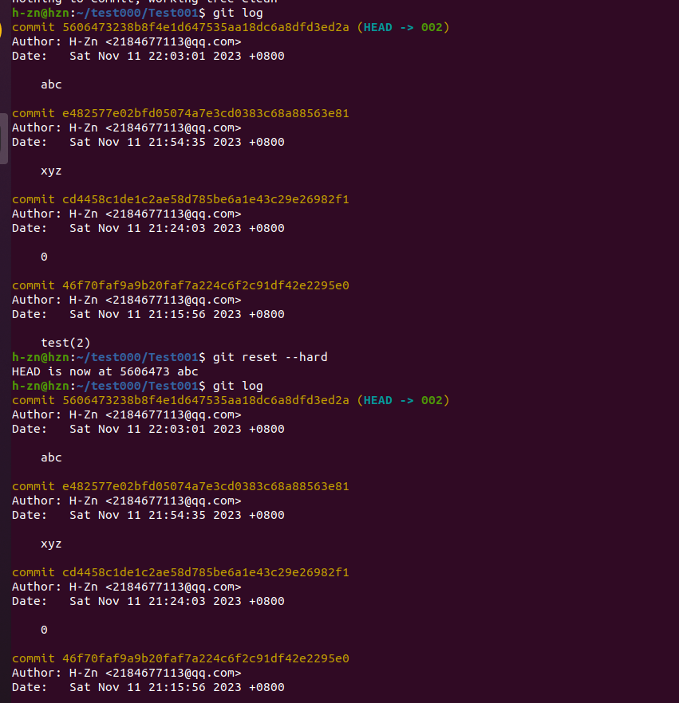
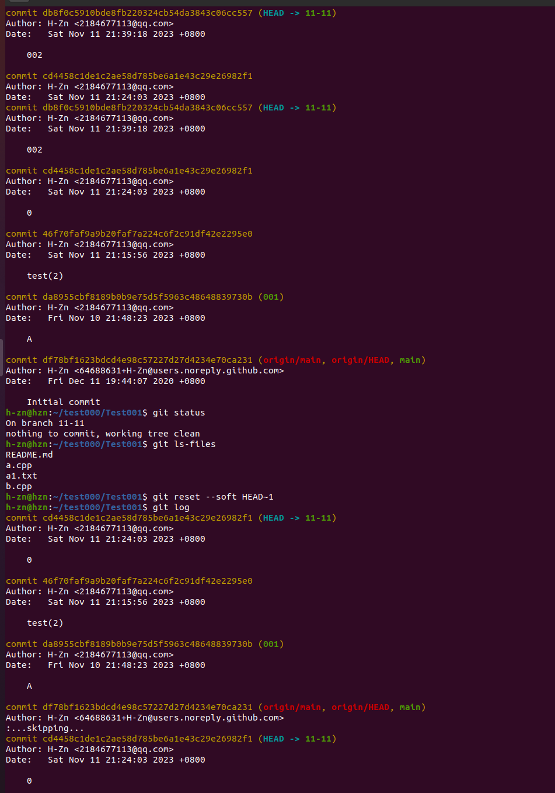
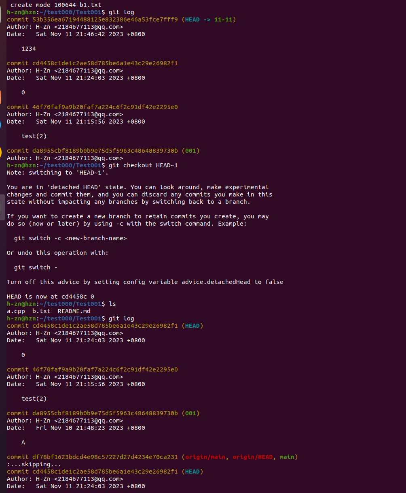

# 第一题

## (1):git reset --hard

## (2):git restore --staged .

# 第二题

## (1)不修改历史

### git revert -n 版本号

### git reset --hard

## (2)修改历史

### git reset --soft HEAD~1

### git checkout HEAD~1

# 第三题

## (1)

git checkout master
git cherry-pick [提交编号]

## (2)
1.  git push --set-upstream origin [分支名】
2.  在github上找到这个分支，开启pull request，然后合并分支

