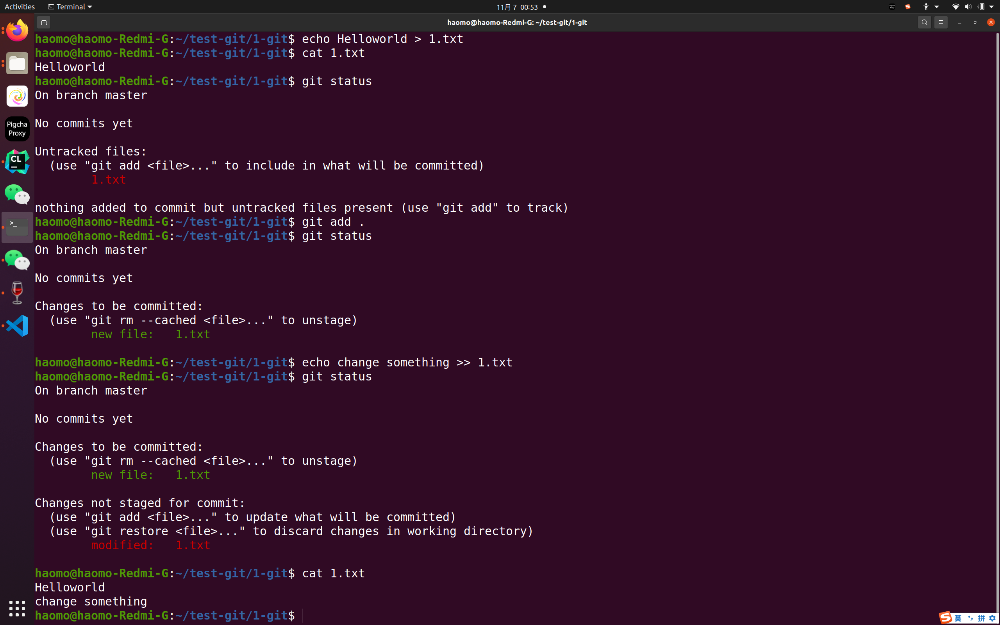
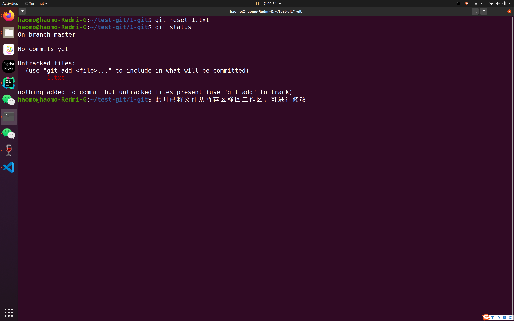
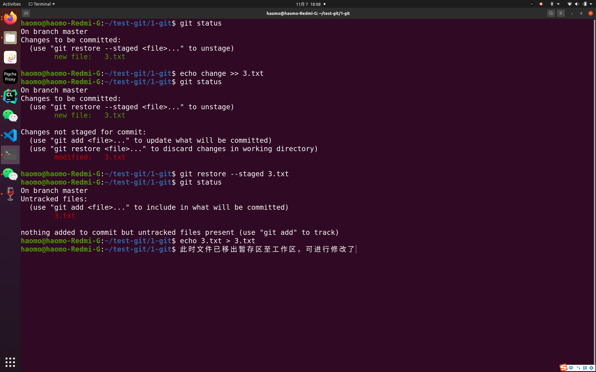
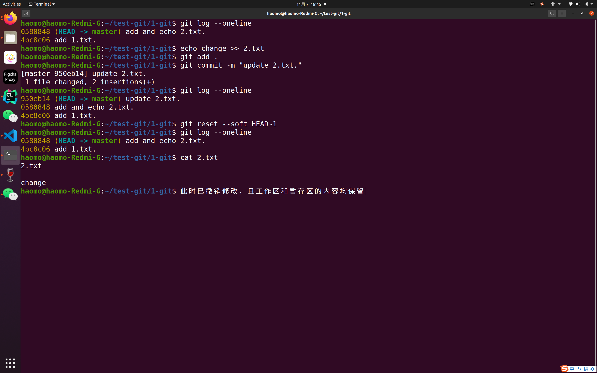
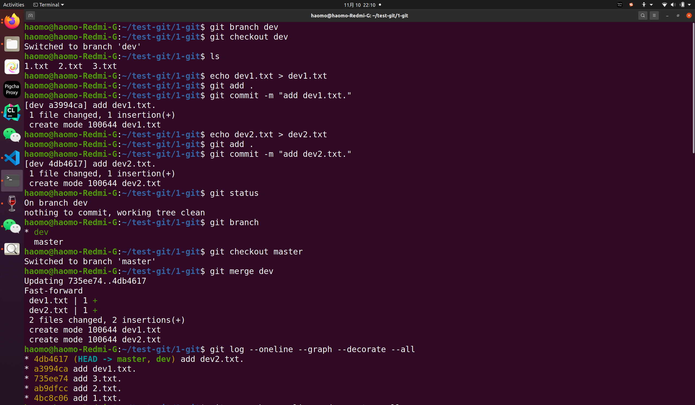
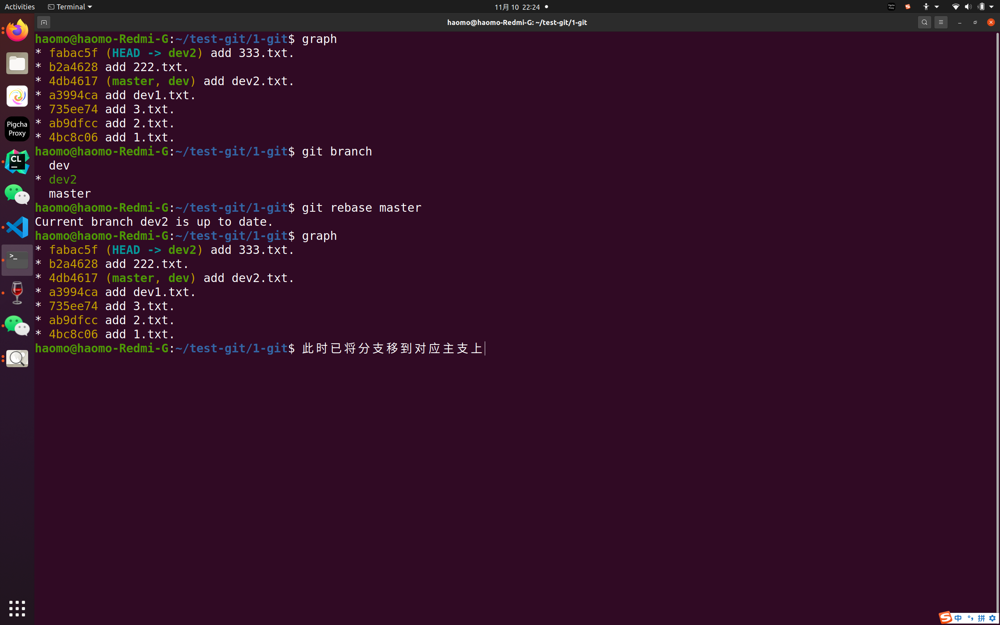

# Git 应用

1. 关于撤销暂存区中的修改
   ①使用git reset将文件移出暂存区，此时工作区还保留修改
   ②使用git restore --staged也是将文件移出暂存区，此时工作区还保留修改 
   ③使用图形化git操作（本质与命令行相同）

   eg:
    
    
      
   #

2. 关于撤销本地仓库中的修改
   ①不修改历史：使用git reset --soft HEAD~1来回退，此时工作区和暂存区中的修改都会保留（--mixed：只保留工作区；--hard：工作区暂存区都撤销）
   Tips：如果使用reset，想推送到远程仓库需使用git push -f（因为少了个commit）
   ②修改历史：使用git revert HEAD~1新增一个commit，但这个commit是撤销修改（可理解为有一个修改change，git revert就是-change）
   eg:
    
    
#

3. 关于合并分支的两种方式
   ①git merge：传统合并
   ②git rebase：将分支直接移动到主支上对应的节点（此节点为创立分支的祖先）
   

   eg:
   传统merge
    
    