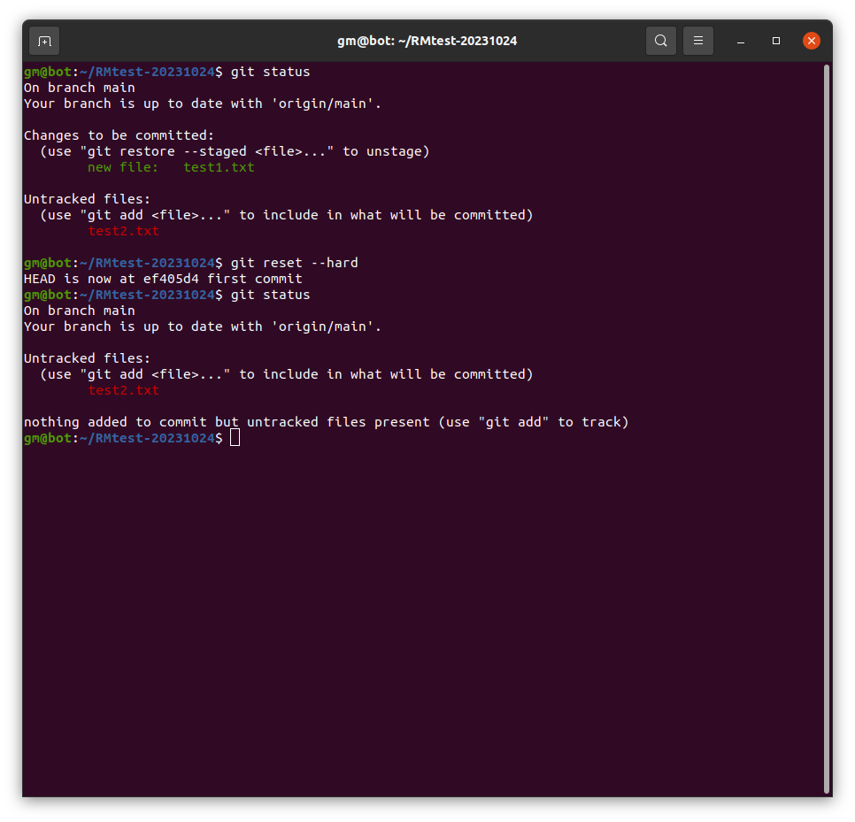
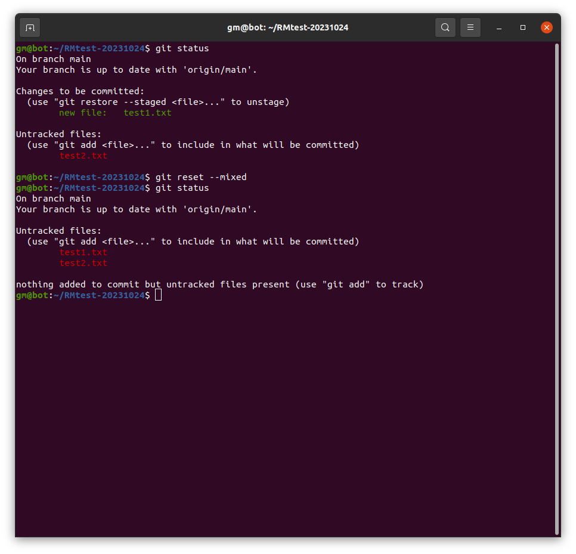
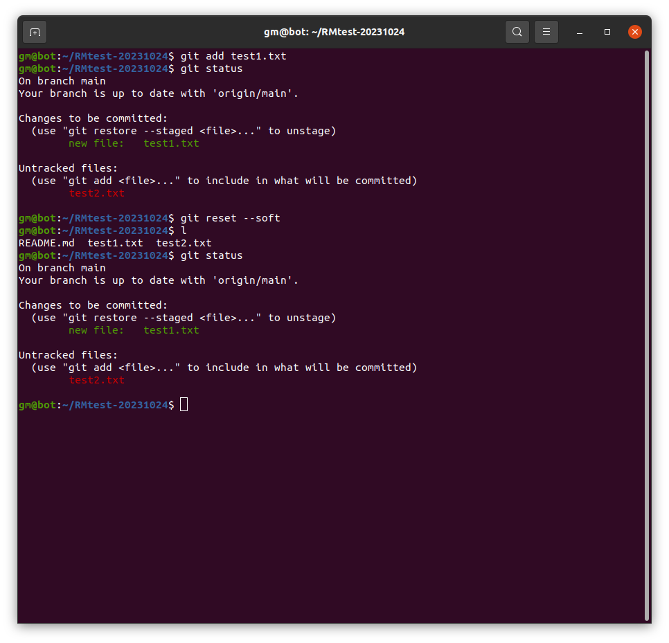
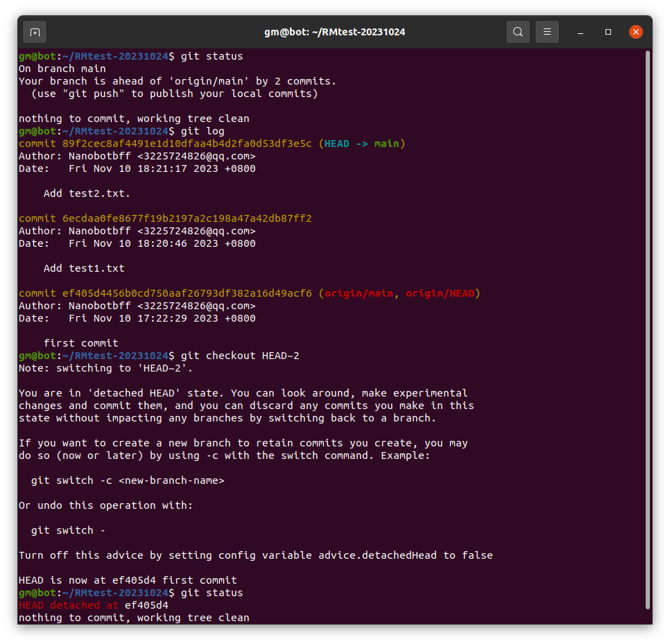
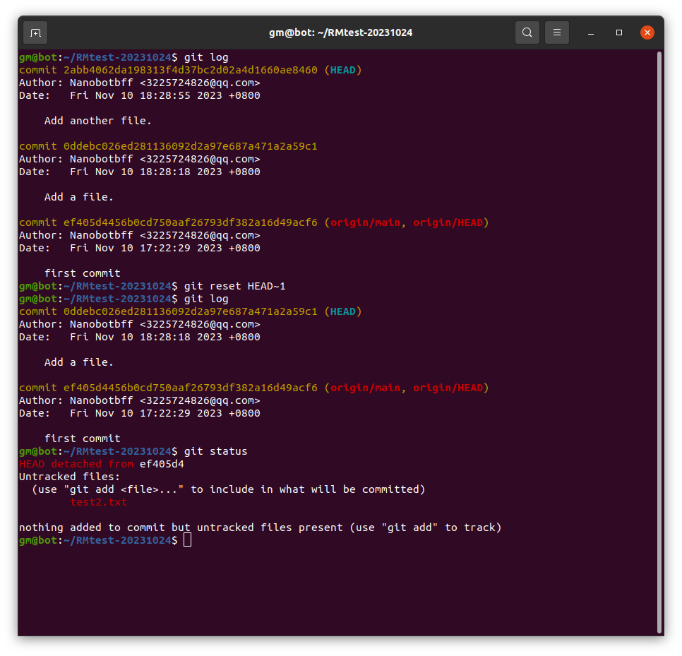
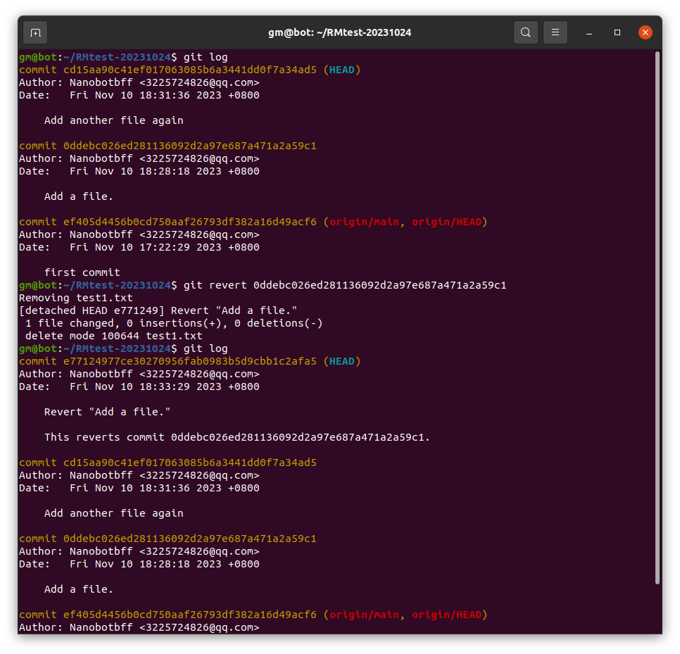

# Git应用

## 一、回退修改前最后一次提交状态

1. 使用git reset
```
git reset --hard	
```
移除工作目录和暂存区的修改


```
git reset --mixed
```
git reset的默认选项，取消暂存区的提交，保留本地修改


```
git reset --soft
```
保留工作目录的修改



2. 使用git checkout
```
git checkout HEAD~2 -- <file>
```
'git checkout'可以撤销对工作目录的修改，恢复到最近的状态，而HEAD~2表示恢复到2次提交时的状态

**'git reset'对缓存区和工作目录进行修改，'git checkout'仅影响工作目录。**


---

## 二、回退版本

1. 使用'git reset'
```
git reset HEAD~1
```
**不修改历史**，这里的1代表移除最近提交


2. 使用'git revert'
```
git log
git revert <commit_id>
```
先查看提交历史，确定需要回到哪，在<>中输入那次的随机id

'git revert'会增加一个提交来改变，**修改历史**。


---

## 三、合并分支

1. 使用git rebase
```
git rebase <branch-name>
```
**避免冲突：可先使用'git pull'**

2. 使用'git pull request'

- github中创建并提交pull request
- 经过管理人审查或提出评论，继续修改或通过
- 批准后便合并到主分支

