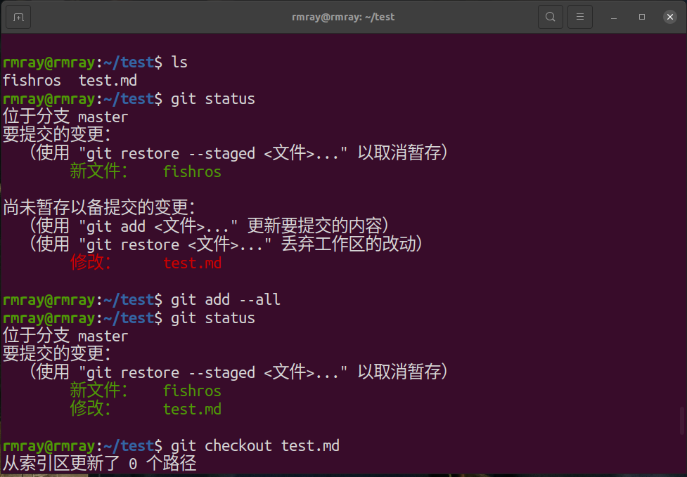
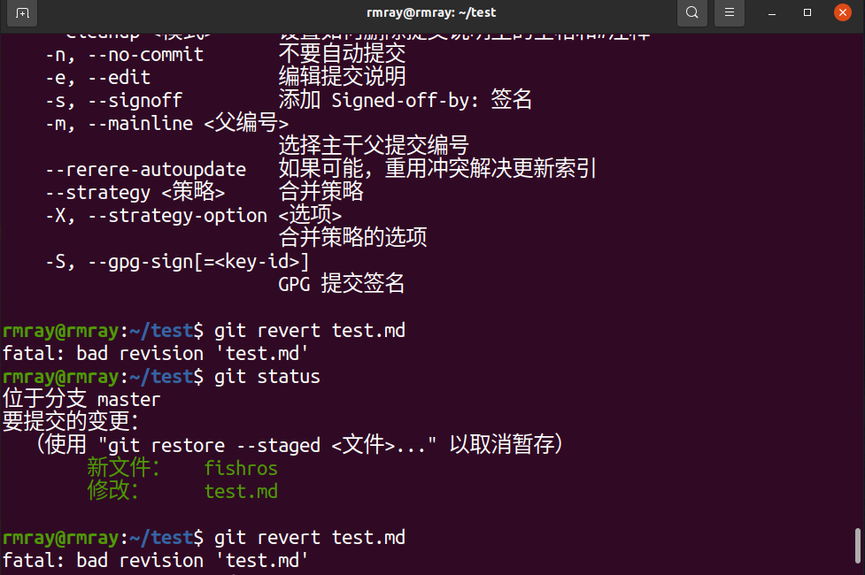
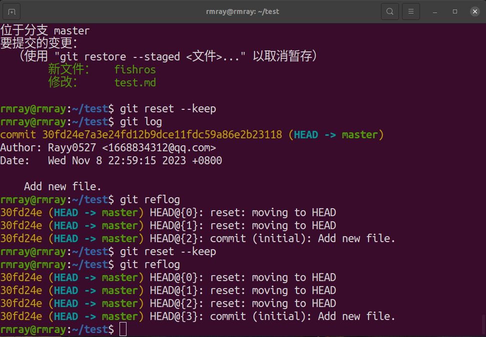
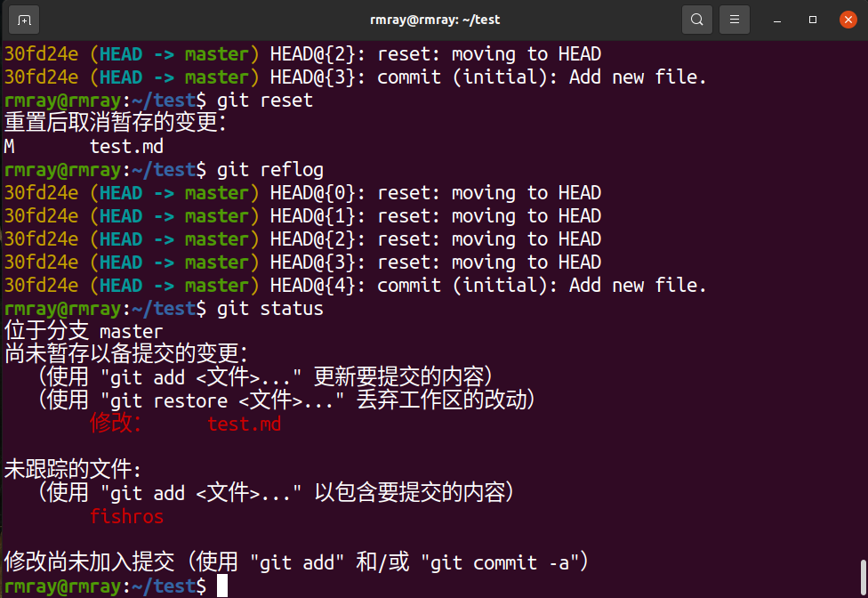
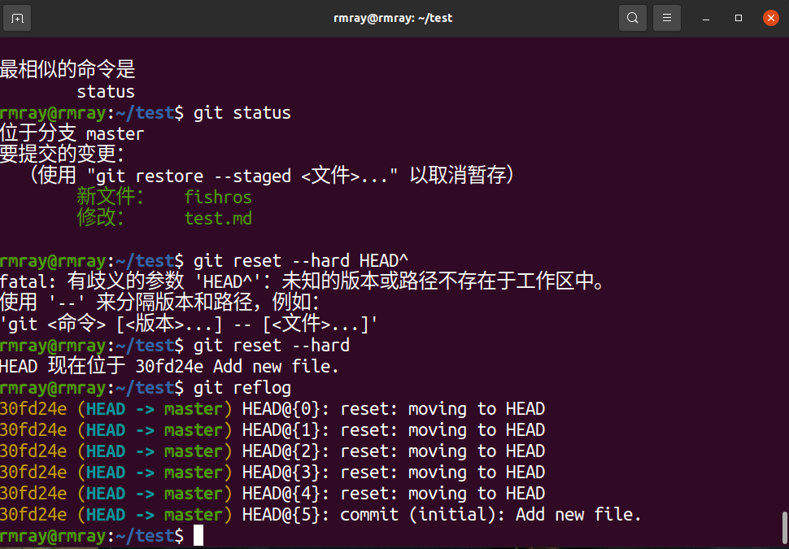
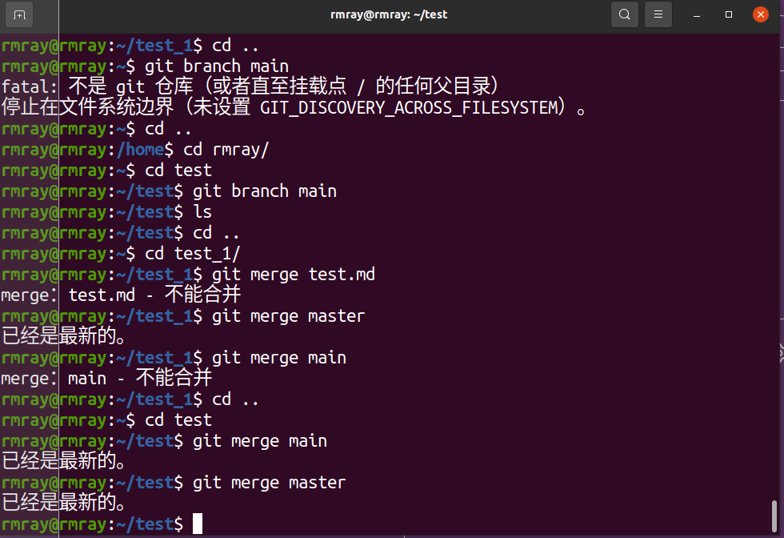
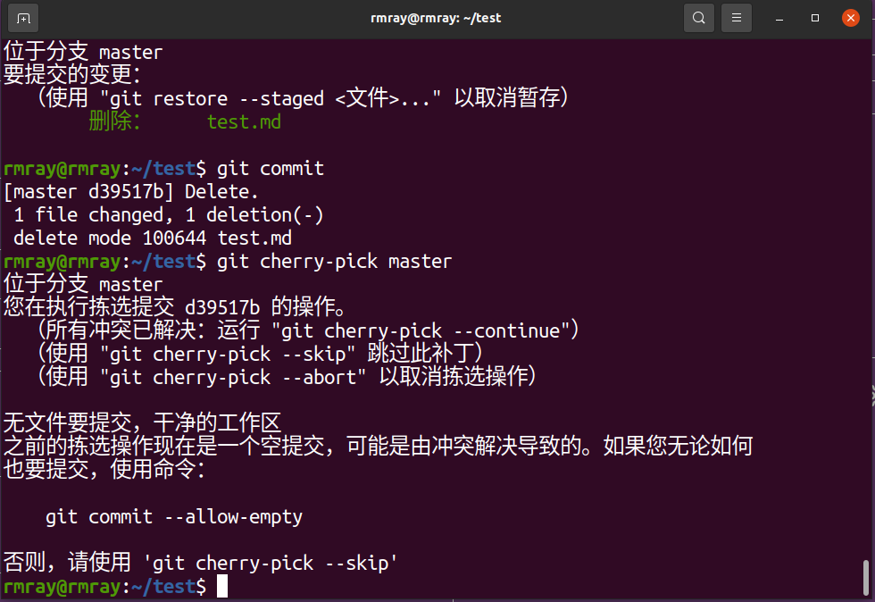

#
**回到最后一次提交**
+ `git checkout --file`
+ `git revert`

#
**回退版本**
##
不修改历史
+ `git reset --keep`
+ `git reset`

##
修改历史
+ `git reset --hard`
+ `git reset --hard HEAD`

#
**合并分支**
+ `git merge`
+ `git cherry-pick`

