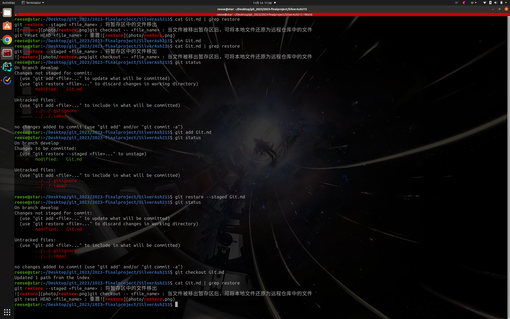
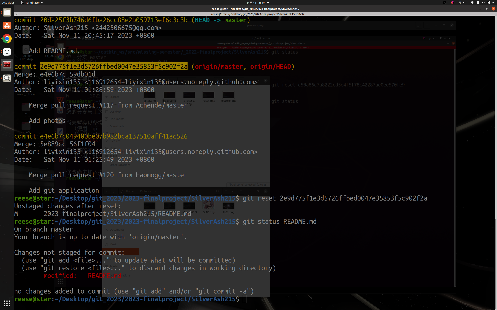
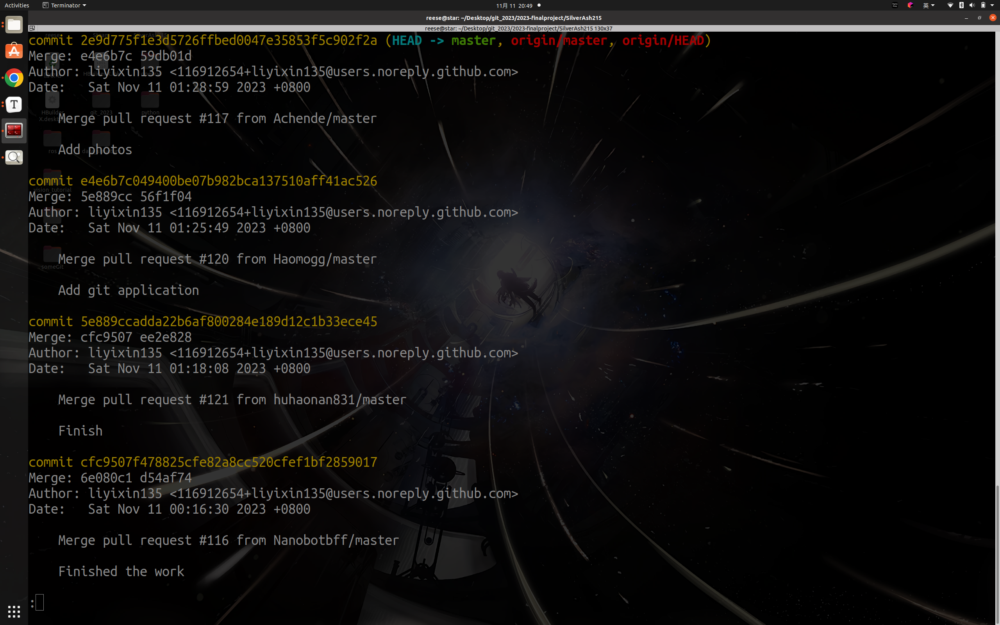

# First
## 1.
git restore --staged <file_name> : 将暂存区中的文件移出

git checkout -- <file_name> : 当文件被移出暂存区后，可将本地文件还原为远程仓库中的文件

## 2.
git reset HEAD <file_name> : 重置

git checkout -- <file_name> : 当文件被移出暂存区后，可将本地文件还原为远程仓库中的文件

# Second
## 1.
git reset --hard <版本号> : 回退版本，删除历史，修改本地仓库

## 2.

git reset <版本号> : 回退版本，删除历史，不修改本地仓库

## 3.

git revert -n <版本号> : 重做版本，增加历史

# Third
## 1.
git rebase  <branch>

## 2.
git cherry-pick <版本号>

