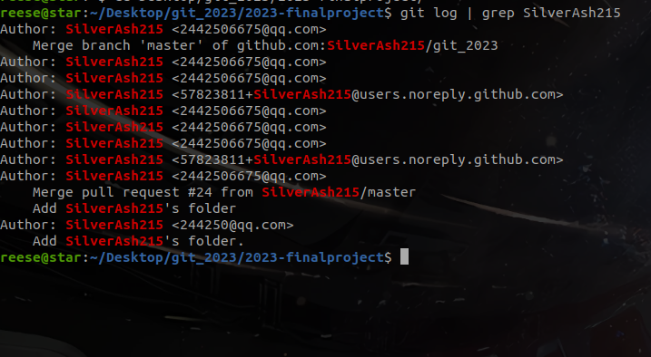
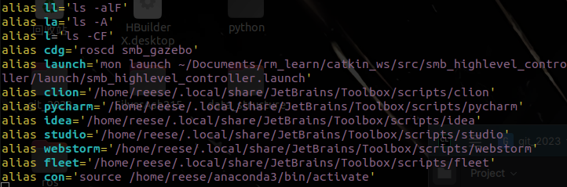
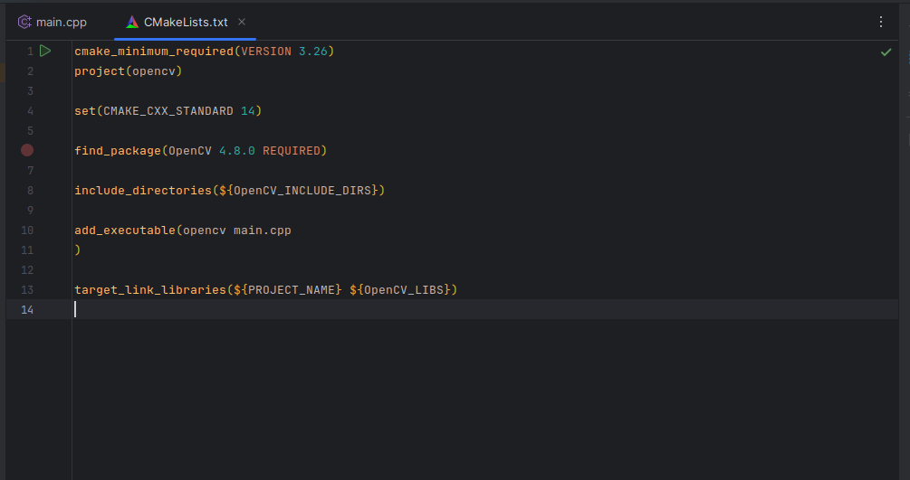

# Final Project

在这次培训中，我学到了关于ubuntu，bash,CMake以及git等的知识。

## First

首先我学习了如何使用vim来提升编程的效率，
同时学习了如何使用命令行工具来编写脚本，从而简化操作。后面还学习了Linux信号，处理用户输入等知识。

## Second

这节课我了解了linux与windows之间的区别；
同时学会了如何使用bash的各种功能，比如说使用"grep"从庞大的数据中寻找到我需要的信息，使用"alias"为命令起一个别名，从而简化操作等。

## Third

在这节课中，我学会了git的使用和以及如何使用git来进行版本控制。

## Fourth

这节课，我学会了如何使用CMake和Catkin，比如如何配置CMakeLists,添加第三方库等让我懂得了如何使用Catkin-tools编译软件包等。

# Summary

总之，感谢DynamicX，让我学到了许多知识。
