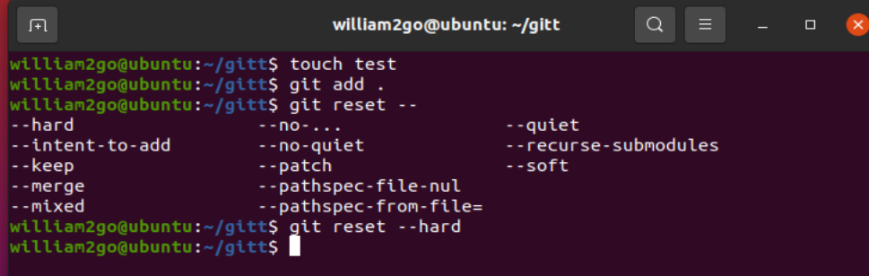
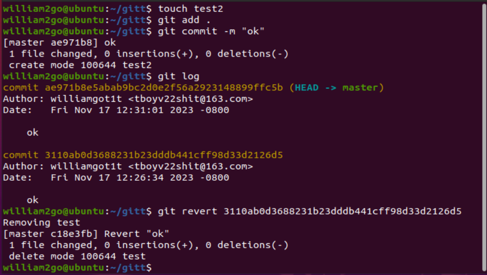
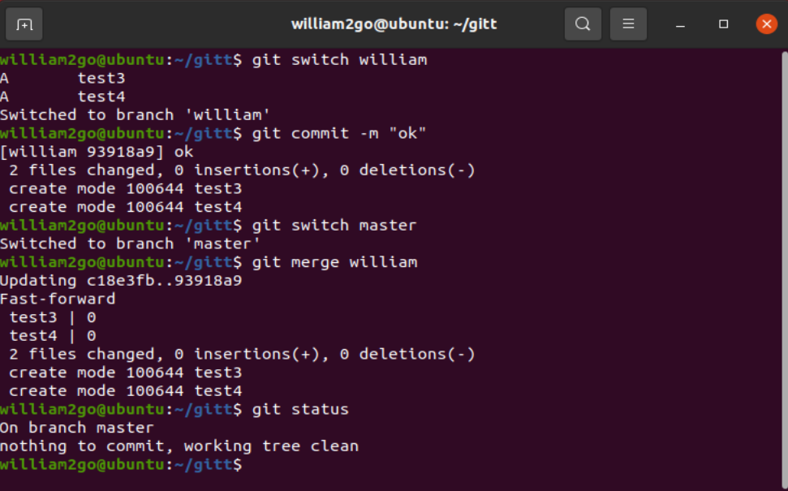
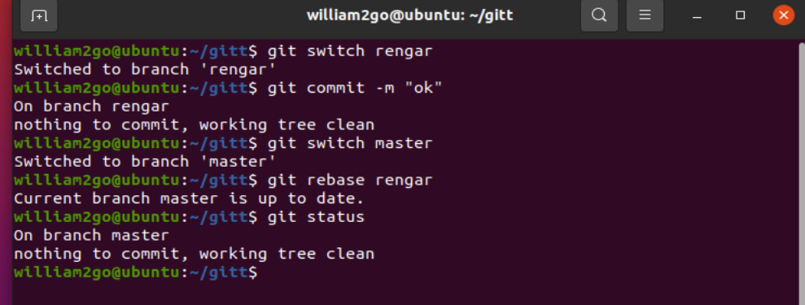

# git‘s application

### 1. 撤销部分修改，恢复到最后一次提交状态的两种方式：

#### 方式1: 使用 `git reset` 恢复修改

用git reset可以撤销修改恢复到最后一次提交的状态

git reset --hard  **

#### 方式2: 使用 `git checkout` 恢复修改

用git check 也可以 恢复修改 

git checkout -- file.txt（指定文件）

git checkout . (恢复整个目录)

### 2. 回退提交的两种方式：

#### 方式1: 使用 `git reset` 回退提交（不修改历史）

git reset --hard ** 会丢弃修改

没有 --hard则会保留修改

#### 方式2: 使用 `git revert` 回退提交（修改历史）

 回退到前一个提交，保留修改，但创建一个新的反转提交

### 3. 合并分支的两种方式：

#### 方式1: 使用 `git merge` 合并分支

先切换到main主分支 在git merge 分支

#### 方式2: 使用 `git rebase` 合并分支

方法与上面相同

