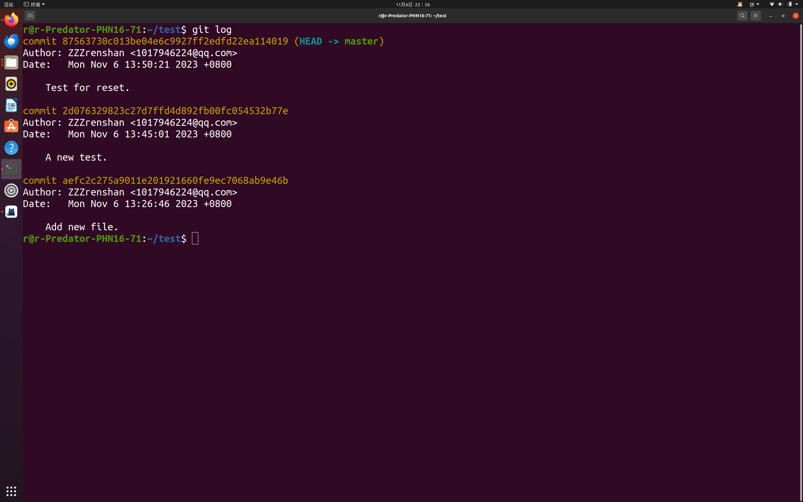
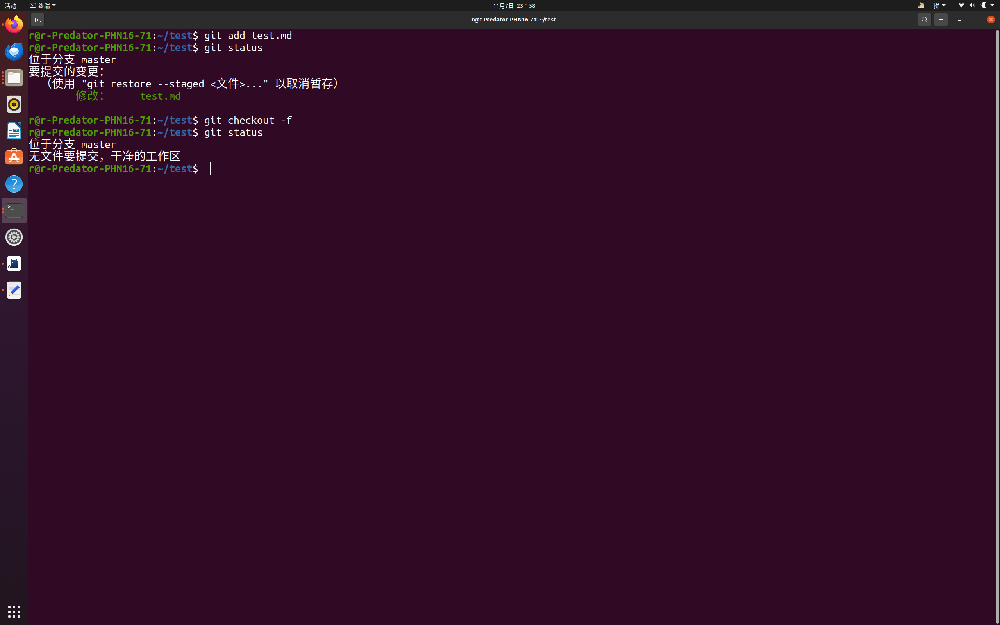
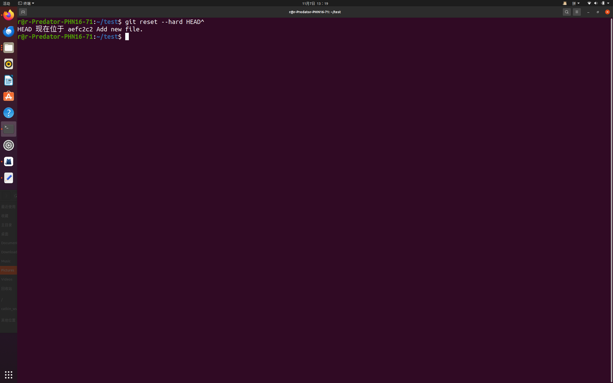
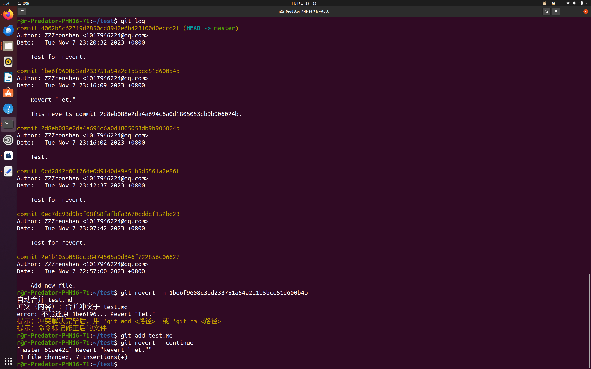
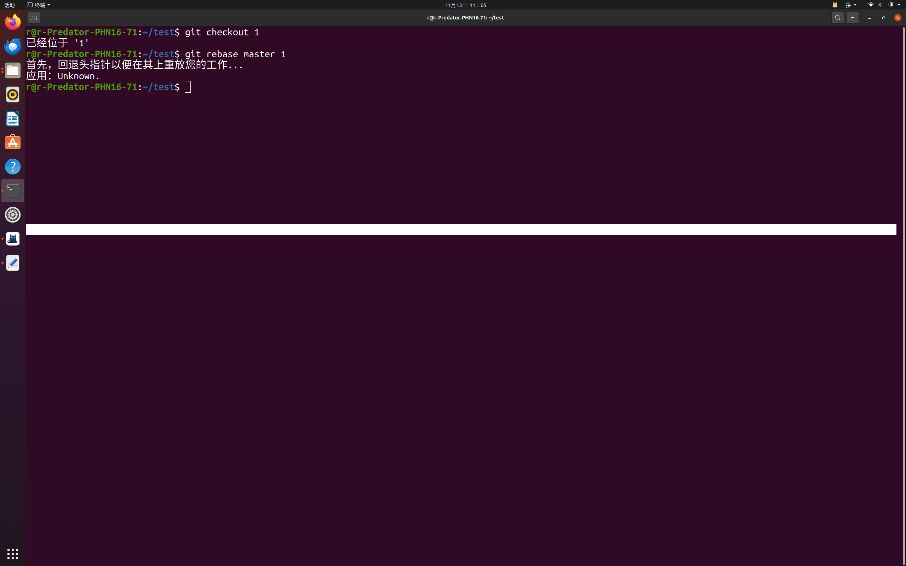
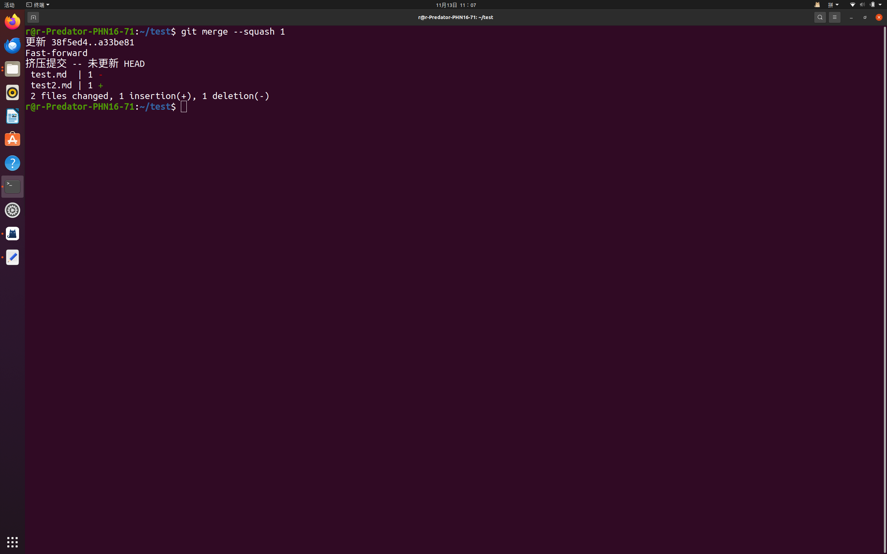

## 1 (1) git  log  

## git reset --hard commit后字符串  

##  (2) git checkout -f

## 2 不修改：  
##         git reset --hard HEAD^

##  修改：  
## git log
## git revert -n 版本号

## 3  
##  (1)  git checkout [branch]
##        git rebase master [branch]

##    (2)  git merge --squash [branch]

