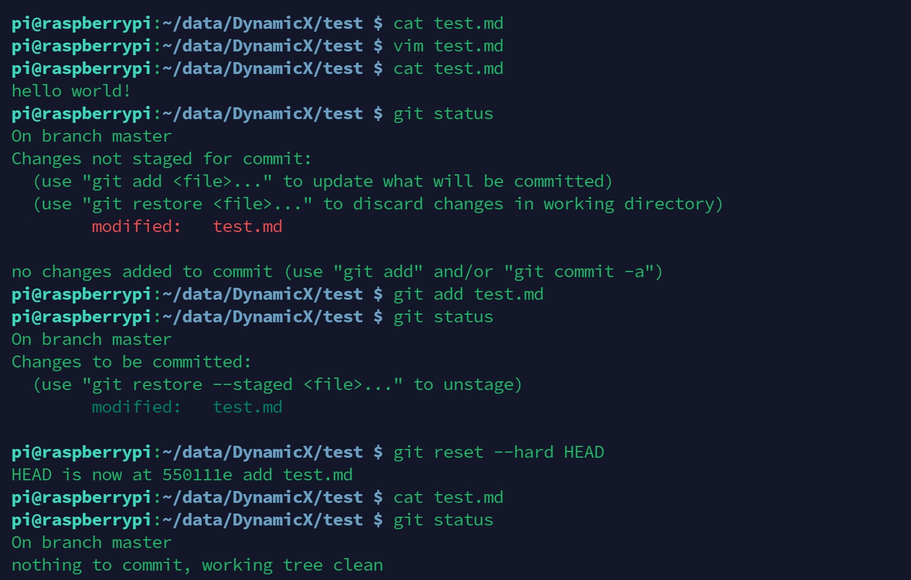
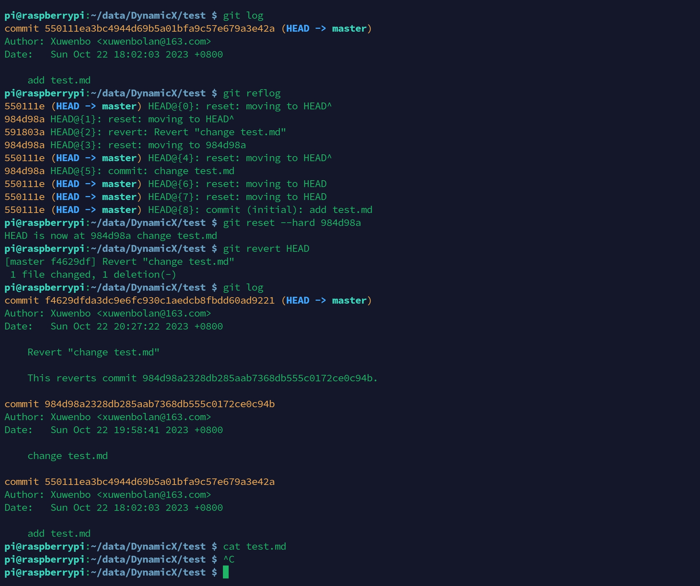
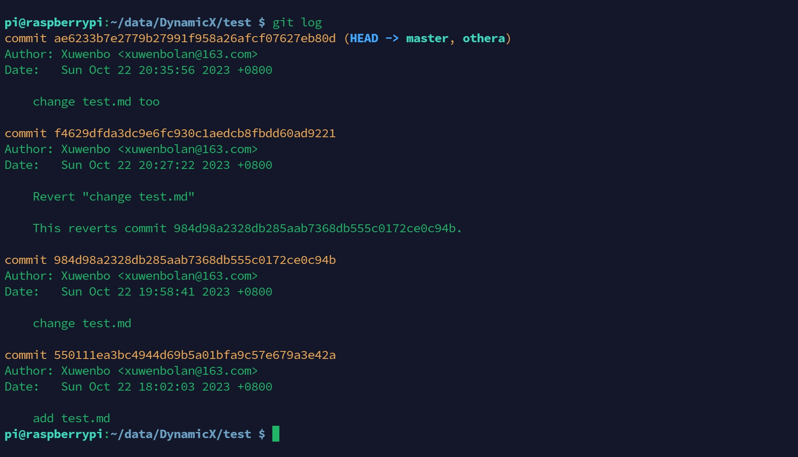
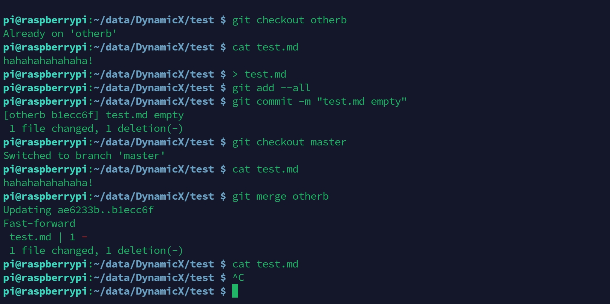

# Git Application


1. 若你已经修改了部分文件、并且将其中的一部分加入了暂存区，应该如何回退这些修改，恢复到修改前最后一次提交的状态？给出至少两种不同的方式

**方式一**：`git reset`

```bash
pi@raspberrypi:~/data/DynamicX/test $ cat test.md 
pi@raspberrypi:~/data/DynamicX/test $ vim test.md 
pi@raspberrypi:~/data/DynamicX/test $ cat test.md 
hello world!
pi@raspberrypi:~/data/DynamicX/test $ git status 
On branch master
Changes not staged for commit:
  (use "git add <file>..." to update what will be committed)
  (use "git restore <file>..." to discard changes in working directory)
        modified:   test.md

no changes added to commit (use "git add" and/or "git commit -a")
pi@raspberrypi:~/data/DynamicX/test $ git add test.md 
pi@raspberrypi:~/data/DynamicX/test $ git status 
On branch master
Changes to be committed:
  (use "git restore --staged <file>..." to unstage)
        modified:   test.md

pi@raspberrypi:~/data/DynamicX/test $ git reset --hard HEAD
HEAD is now at 550111e add test.md
pi@raspberrypi:~/data/DynamicX/test $ cat test.md 
pi@raspberrypi:~/data/DynamicX/test $ git status 
On branch master
nothing to commit, working tree clean
pi@raspberrypi:~/data/DynamicX/test $ 
```



**方式二**：`git restore`

```bash
pi@raspberrypi:~/data/DynamicX/test $ cat test.md 
pi@raspberrypi:~/data/DynamicX/test $ vim test.md
pi@raspberrypi:~/data/DynamicX/test $ cat test.md 
hello world!
pi@raspberrypi:~/data/DynamicX/test $ git add test.md 
pi@raspberrypi:~/data/DynamicX/test $ 
pi@raspberrypi:~/data/DynamicX/test $ git status 
On branch master
Changes to be committed:
  (use "git restore --staged <file>..." to unstage)
        modified:   test.md

pi@raspberrypi:~/data/DynamicX/test $ git restore --staged test.md
pi@raspberrypi:~/data/DynamicX/test $ git restore test.md
pi@raspberrypi:~/data/DynamicX/test $ cat test.md 
pi@raspberrypi:~/data/DynamicX/test $ 
```


2. 若你已经提交了一个新版本，需要回退该版本，应该如何操作？分别给出不修改历史或修改历史的至少两种不同的方式

**不修改提交历史的方式：**

**方式一**：`git reset HEAD^`

```bash
pi@raspberrypi:~/data/DynamicX/test $ git log
commit 984d98a2328db285aab7368db555c0172ce0c94b (HEAD -> master)
Author: Xuwenbo <xuwenbolan@163.com>
Date:   Sun Oct 22 19:58:41 2023 +0800

    change test.md

commit 550111ea3bc4944d69b5a01bfa9c57e679a3e42a
Author: Xuwenbo <xuwenbolan@163.com>
Date:   Sun Oct 22 18:02:03 2023 +0800

    add test.md
pi@raspberrypi:~/data/DynamicX/test $ git reset HEAD^
pi@raspberrypi:~/data/DynamicX/test $ git log
commit 550111ea3bc4944d69b5a01bfa9c57e679a3e42a (HEAD -> master)
Author: Xuwenbo <xuwenbolan@163.com>
Date:   Sun Oct 22 18:02:03 2023 +0800

    add test.md
pi@raspberrypi:~/data/DynamicX/test $ 
```


**方式二**：`git revert`

```bash
pi@raspberrypi:~/data/DynamicX/test $ git log
commit 550111ea3bc4944d69b5a01bfa9c57e679a3e42a (HEAD -> master)
Author: Xuwenbo <xuwenbolan@163.com>
Date:   Sun Oct 22 18:02:03 2023 +0800

    add test.md
pi@raspberrypi:~/data/DynamicX/test $ git reflog 
550111e (HEAD -> master) HEAD@{0}: reset: moving to HEAD^
984d98a HEAD@{1}: reset: moving to HEAD^
591803a HEAD@{2}: revert: Revert "change test.md"
984d98a HEAD@{3}: reset: moving to 984d98a
550111e (HEAD -> master) HEAD@{4}: reset: moving to HEAD^
984d98a HEAD@{5}: commit: change test.md
550111e (HEAD -> master) HEAD@{6}: reset: moving to HEAD
550111e (HEAD -> master) HEAD@{7}: reset: moving to HEAD
550111e (HEAD -> master) HEAD@{8}: commit (initial): add test.md
pi@raspberrypi:~/data/DynamicX/test $ git reset --hard 984d98a
HEAD is now at 984d98a change test.md
pi@raspberrypi:~/data/DynamicX/test $ git revert HEAD
[master f4629df] Revert "change test.md"
 1 file changed, 1 deletion(-)
pi@raspberrypi:~/data/DynamicX/test $ git log
commit f4629dfda3dc9e6fc930c1aedcb8fbdd60ad9221 (HEAD -> master)
Author: Xuwenbo <xuwenbolan@163.com>
Date:   Sun Oct 22 20:27:22 2023 +0800

    Revert "change test.md"
    
    This reverts commit 984d98a2328db285aab7368db555c0172ce0c94b.

commit 984d98a2328db285aab7368db555c0172ce0c94b
Author: Xuwenbo <xuwenbolan@163.com>
Date:   Sun Oct 22 19:58:41 2023 +0800

    change test.md

commit 550111ea3bc4944d69b5a01bfa9c57e679a3e42a
Author: Xuwenbo <xuwenbolan@163.com>
Date:   Sun Oct 22 18:02:03 2023 +0800

    add test.md
pi@raspberrypi:~/data/DynamicX/test $ cat test.md 
pi@raspberrypi:~/data/DynamicX/test $ 
```



3. 我们已经知道了合并分支可以使用 merge，但这不是唯一的方法，给出至少两种不同的合并分支的方式

**方式一**：`git rebase`

```bash
pi@raspberrypi:~/data/DynamicX/test $ git branch 
  master
* othera
pi@raspberrypi:~/data/DynamicX/test $ cat test.md 
hahahahahahaha!
pi@raspberrypi:~/data/DynamicX/test $ git checkout master 
Switched to branch 'master'
pi@raspberrypi:~/data/DynamicX/test $ cat test.md 
pi@raspberrypi:~/data/DynamicX/test $ git rebase othera
Successfully rebased and updated refs/heads/master.
pi@raspberrypi:~/data/DynamicX/test $ cat test.md 
hahahahahahaha!
pi@raspberrypi:~/data/DynamicX/test $ 
```



**方式二**：`git merge`

```bash
pi@raspberrypi:~/data/DynamicX/test $ git checkout otherb
Already on 'otherb'
pi@raspberrypi:~/data/DynamicX/test $ cat test.md 
hahahahahahaha!
pi@raspberrypi:~/data/DynamicX/test $ > test.md 
pi@raspberrypi:~/data/DynamicX/test $ git add --all 
pi@raspberrypi:~/data/DynamicX/test $ git commit -m "test.md empty"
[otherb b1ecc6f] test.md empty
 1 file changed, 1 deletion(-)
pi@raspberrypi:~/data/DynamicX/test $ git checkout master 
Switched to branch 'master'
pi@raspberrypi:~/data/DynamicX/test $ cat test.md 
hahahahahahaha!
pi@raspberrypi:~/data/DynamicX/test $ git merge otherb
Updating ae6233b..b1ecc6f
Fast-forward
 test.md | 1 -
 1 file changed, 1 deletion(-)
pi@raspberrypi:~/data/DynamicX/test $ cat test.md 
pi@raspberrypi:~/data/DynamicX/test $ 
```


