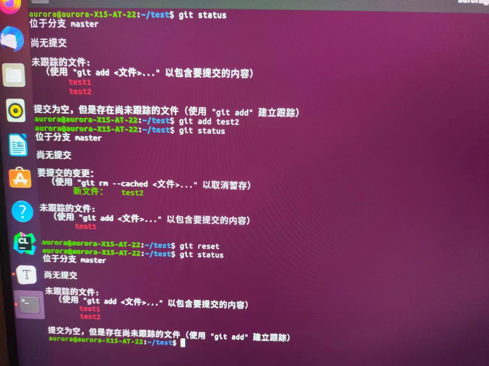
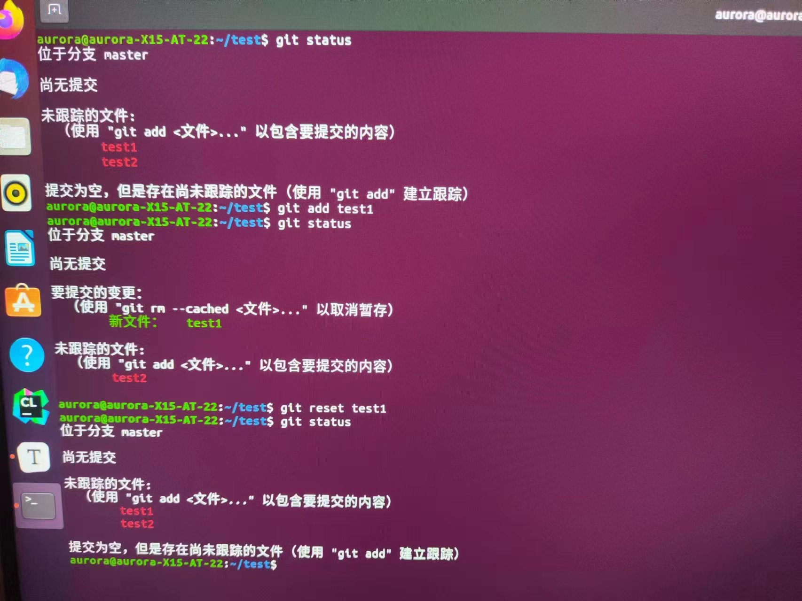
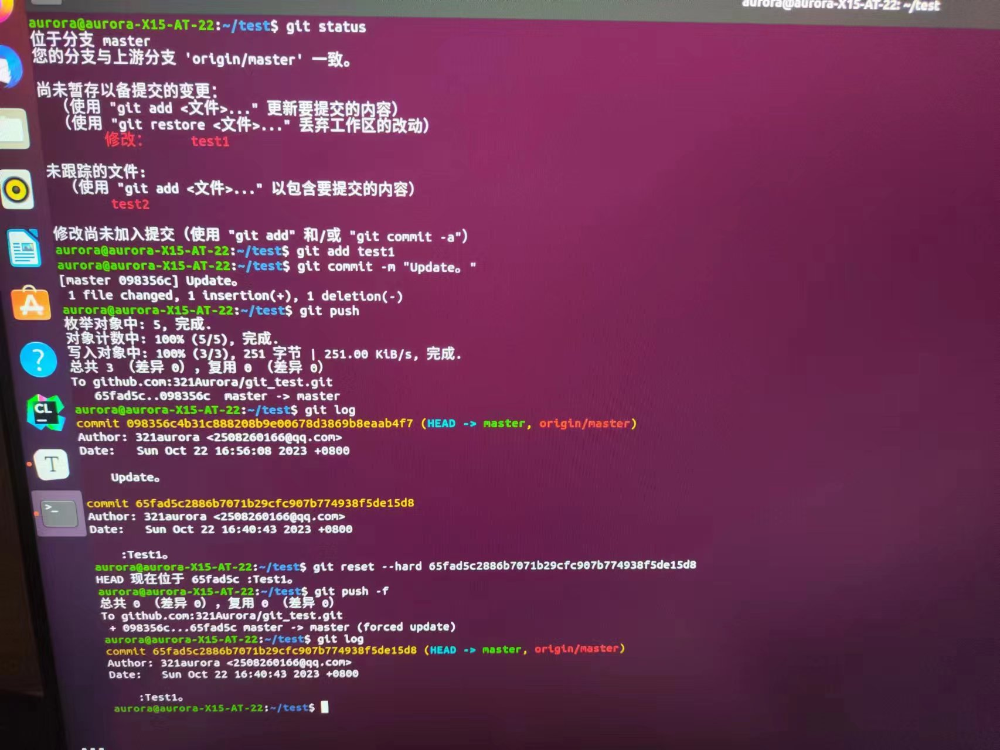
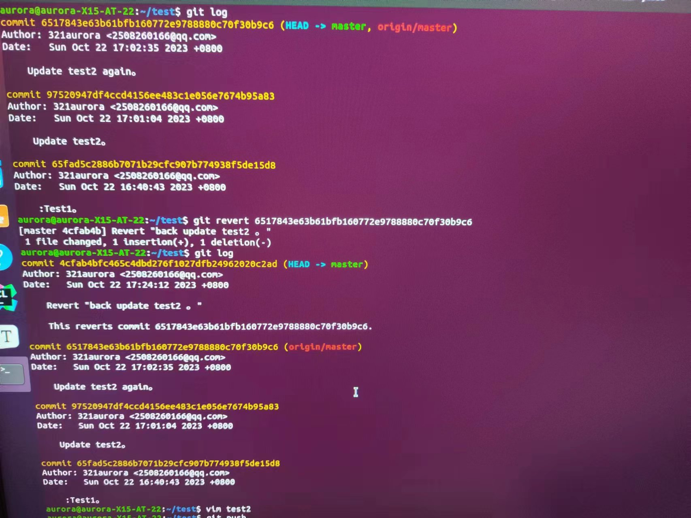
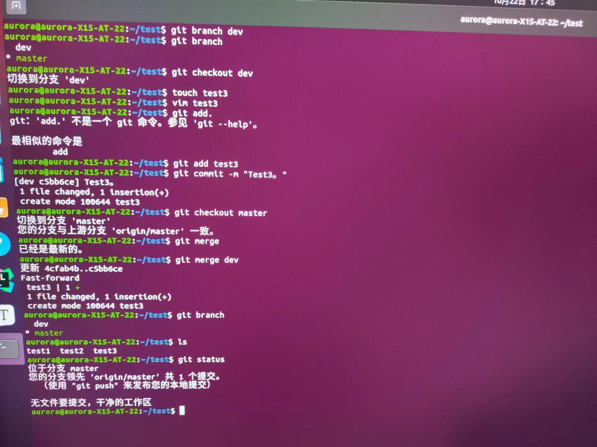
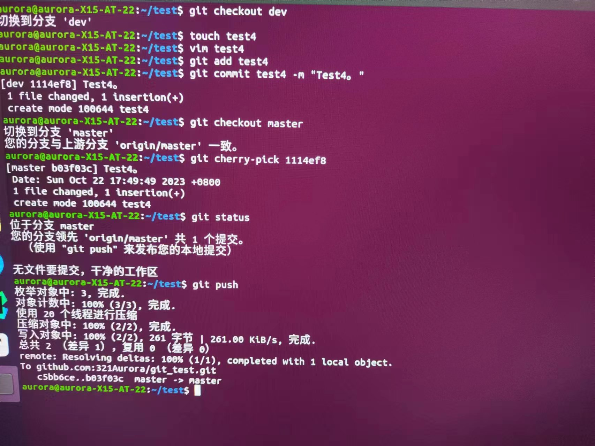

#### 1.若你已经修改了部分文件、并且将其中的一部分加入了暂存区，应该如何回退这些修改，恢复到修改前最后一次提交的状态？给出至少两种不同的方式

通过 git checkout -- 文件名 命令可以撤销文件在工作区的修改。
通过 git reset 命令可以撤销之前的所有 git add 操作，即在暂存区的修改。(慎用）

通过 git reset <文件名> 命令可以撤销指定文件的 git add 操作，即这个文件在暂存区的修改。

#### 2.若你已经提交了一个新版本，需要回退该版本，应该如何操作？分别给出不修改历史或修改历史的至少两种不同的方式

git reset --hard（撤销并舍弃版本号之后的提交记录）(修改历史)

git reset HEAD~1命令可以回退到上一个版本。这个命令将会撤销最近的一次提交(修改历史)

git revert（撤销，但是保留了提交记录）(不修改历史)

不修改历史-1698050372038-47.jpeg)

#### 3.我们已经知道了合并分支可以使用 merge，但这不是唯一的方法，给出至少两种不同的合并分支的方式

1.使用merge命令合并分支

2.合并某个分支上的单个commit（cherry-pick命令）

