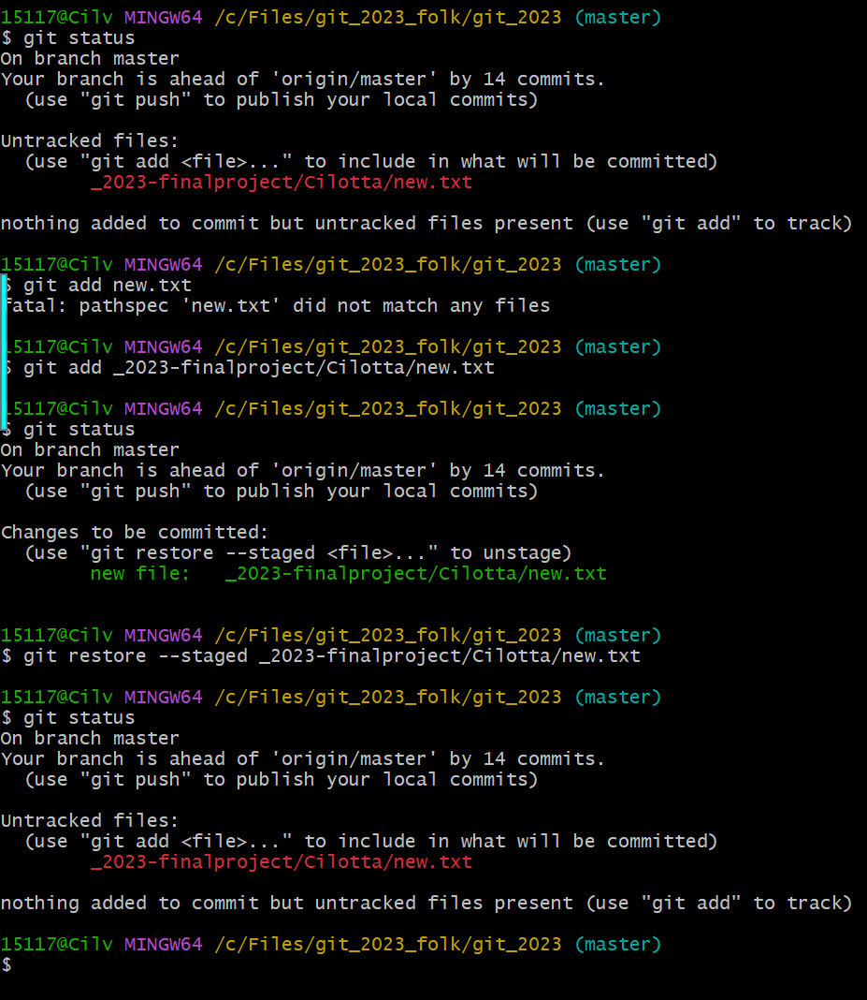
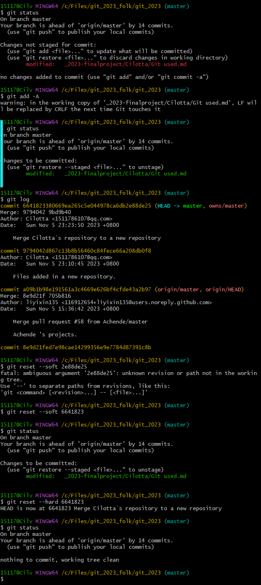
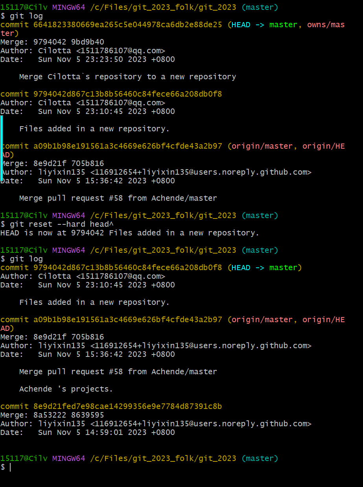
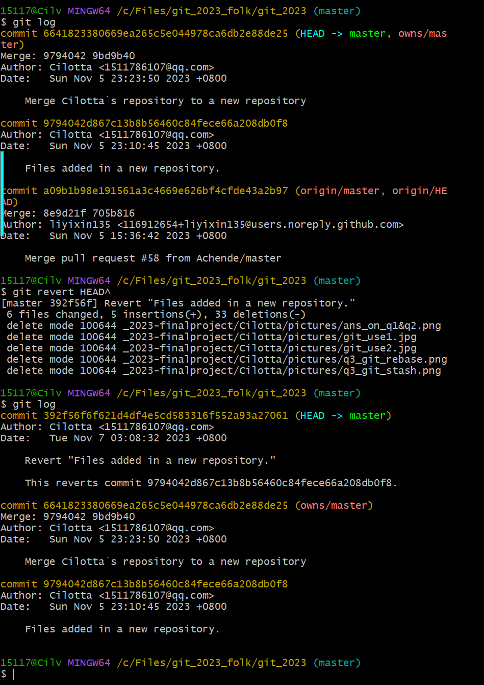
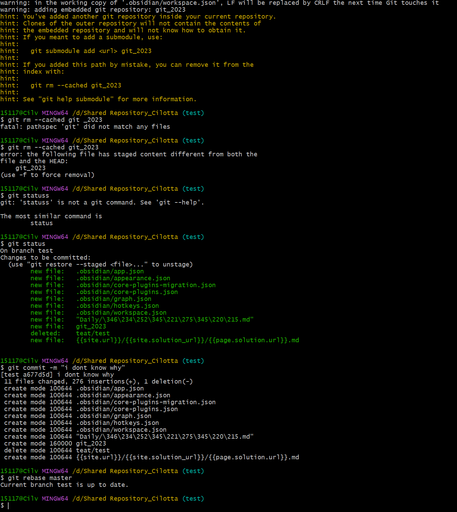
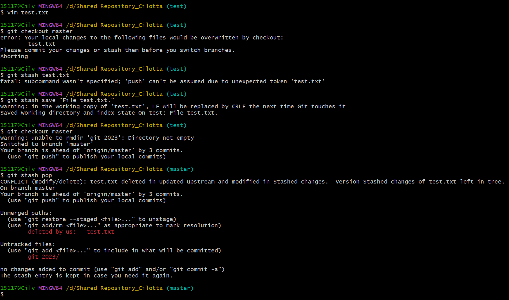
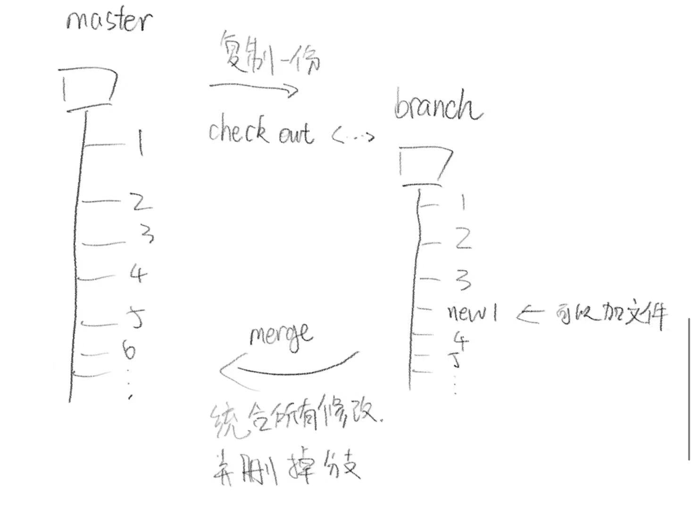
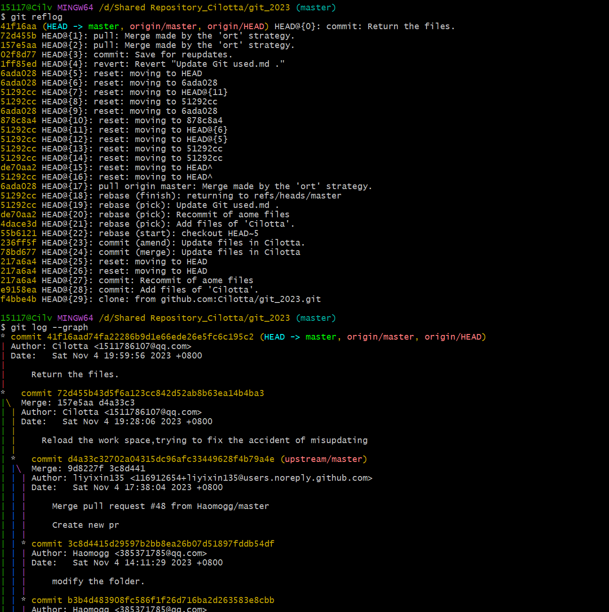

## 1:
---
-- git reset <参数> \[指定commit\]:
回退至指定commit处,并将其之后的修改...
* 保留在暂存区中 (--soft参数)
* 完全不保存  (--hard参数)
* 保留在工作区 (无参数或 --mixed参数)
-- git restore -- <file_path_name>
回退未commit但已add的文件


---
--git checkout --\<filename\>
* 直接退回到上一次commit后的环境,回退所有提交了的缓存区内容

## 2:
---
-- git reset --hard \[参数\]
* head :当前版本
* head^ :上一个版本
* head^^ :上上个版本
* head~3 :回退三个版本
* 直接指代在```git log```中的哈希值 :回退到指定历史版本(也意味着移动head指针)
(此修改会移除log中的commit信息)


---
-- git revert \[参数\]
* HEAD :上一次的提交
* HEAD^ :上上次的提交
* (指定版本哈希) :指定提交
(此修改不移除log中commit参数,相反,它会增加一个commit来说明这次变动)

## 3:
---
-- git rebase \[main line\] \[other lines\]
* 将\[other lines\]中的数据直接合并到\[main lines\]
* 或者说是将\[other lines\]中的修改与\[main lines\]对比,提取,应用

-- git stash
* stash指缓存文件,以方便不同分支间紧急切换又不想commit的情况
* (test)git stash save "Save the files in test"
* git checkout test
* (main)git stash pop
* (此处如果有冲突就要修改冲突)
* 此方法将test上未add的文件强制搬到main中.


---
##### 附件
---
本地git的工作原理


---
个人绘画表示分支主支的关系


---
q1&q2的实战使用场面(指不小心pull了导致必须要回退版本)
