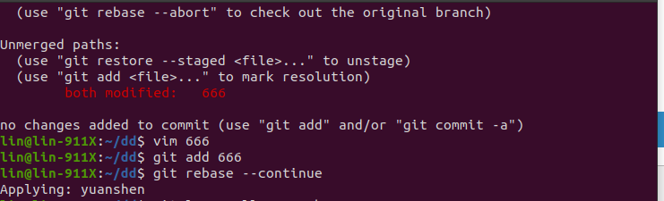

## 任务一：Git 回滚操作

### 问题描述
若你已经修改了部分文件、并且将其中的一部分加入了暂存区，应该如何回退这些修改，恢复到修改前最后一次提交的状态？给出至少两种不同的方式
### 解决方案
1. 使用 `git checkout -- <file_name>` 命令来撤销对工作区的修改。

2. 另一种方法是使用 `git reset HEAD -- <file_name>` 命令，重置工作目录和暂存区到最后一次提交的状态。

## 任务二：回退提交版本

### 问题描述
若你已经提交了一个新版本，需要回退该版本，应该如何操作？分别给出不修改历史或修改历史的至少两种不同的
方式

### 解决方案
1. 使用 `git reset --hard <xxxxx>` 来撤销上一次的提交，保留修改文件。

2. 如果需要修改提交历史，可以使用 `git revert <xxxxx>` 命令来创建一个新的提交，来撤销指定的提交。

## 任务三：合并分支

### 问题描述
我们已经知道了合并分支可以使用 merge，但这不是唯一的方法，给出至少两种不同的合并分支的方式
### 解决方案
1. 使用 `git merge <branch_name>` 来合并分支。

2. 使用 `git rebase <branch_name>` 来合并分支。

## 备注
1. 在使用 `rebase <branch_name>` 合并时，可能出现冲突，需要手动调解。
2. 没搞好图床和HTML，排版有点乱。学姐凑合着看吧
