# 简易Github协作


- [简易Github协作](#简易github协作)
  - [git和github的准备工作](#git和github的准备工作)
    - [git的下载安装](#git的下载安装)
    - [github的账户](#github的账户)
    - [git和github的ssh密钥](#git和github的ssh密钥)
  - [git的简易使用](#git的简易使用)
    - [git版本管理](#git版本管理)
    - [git分支](#git分支)
    - [README.md和.gitignore](#readmemd和gitignore)
  - [git与github](#git与github)
    - [git\_push](#git_push)
    - [git\_clone](#git_clone)
    - [release](#release)


***

##  git和github的准备工作


### git的下载安装

+ WINDOWS

[git下载网址](https://git-scm.com/downloads) 

git的安装就不多赘述:[WINDOWS_git安装](https://blog.csdn.net/Deng872347348/article/details/111883306)

安装完后在需要版本管理的文件夹下右键后点击git bash就可进入命令会话窗口

```bash
git config --global  user.name "这里换上你的用户名"
git config --global  user.email "这里换上你的邮箱"
```

上面的邮箱和用户名可以随便取

+ Linux(Ubuntu)

这里我只讲Ubuntu20.04以上的git安装，其他版本或linux分支可自行搜索

``` bash
sudo apt update 
sudo apt install git
```

在终端输入git有git的信息输出则安装好了。

在需要进行管理的文件打开终端输入git，有信息则安装成功。

git用户初始化和上述同理


***

### github的账户

在[github](https://github.com/)上现注册个人账号，不多赘述


### git和github的ssh密钥

``` bash
ssh-keygen -t rsa -C "这里换上你的邮箱"
```

这里的邮箱必须和github账号上的邮箱一致。

执行命令后需要进行3次或4次确认：

  * 确认秘钥的保存路径（如果不需要改路径则直接回车）；
  * 如果上一步置顶的保存路径下已经有秘钥文件，则需要确认是否覆盖（如果之前的秘钥不再需要则直接回车覆盖，如需要则手动拷贝到其他目录后再覆盖）；
  * 创建密码（如果不需要密码则直接回车）；
  * 确认密码；

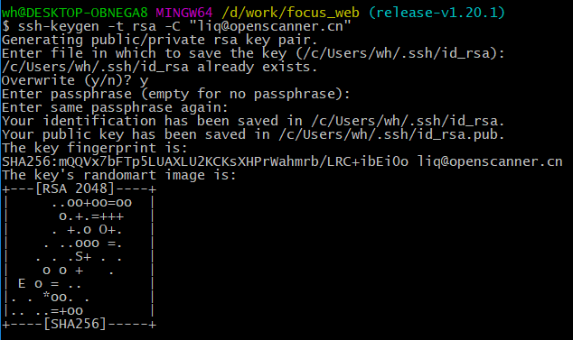

打开指定路径的id_rsa.pub文件复制密钥

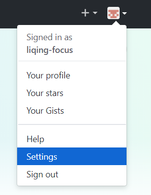

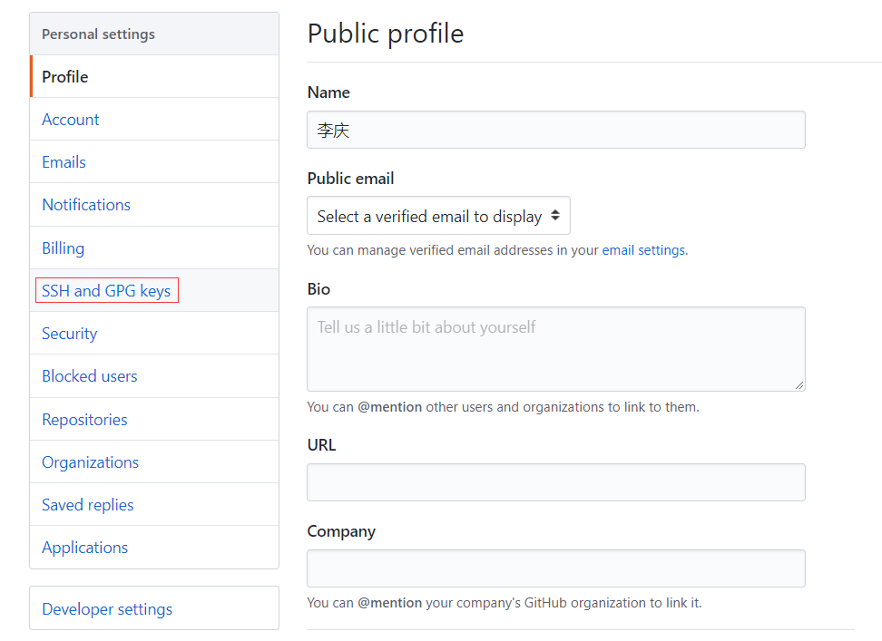

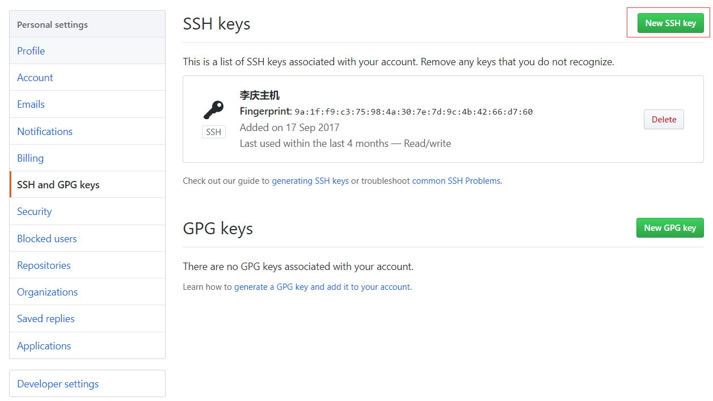

在下面框粘贴再点击“add ssh key”就行了
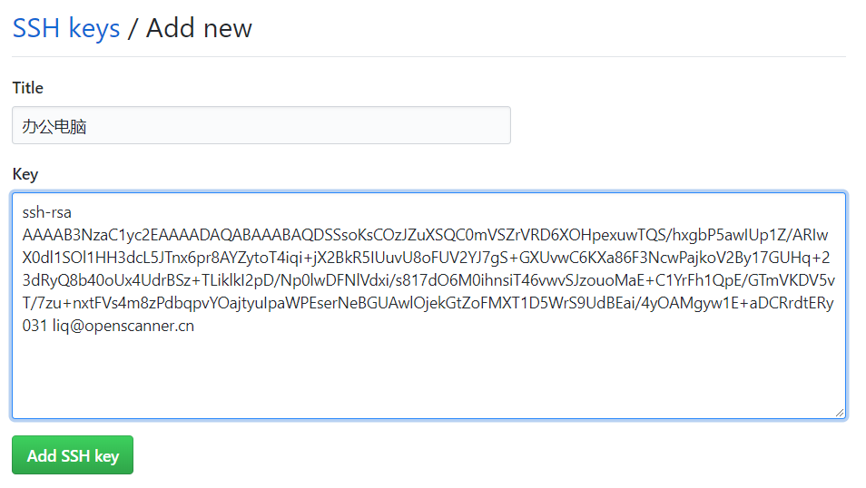
[参考文章](https://blog.csdn.net/lqlqlq007/article/details/78983879)


***

## git的简易使用

### git版本管理 


* 在文件夹右键git bash或打开终端指向该文件夹

```bash
git init
```

主分支master被创建，这时文件夹会多出.git 的隐藏文件夹，版本管理的信息都在该文件夹

在文件夹加入一个.txt后缀文件并写上内容保存

```bash
git status  #查看文件状态
```

终端输出

```bash
位于分支 master

尚无提交

未跟踪的文件:
  （使用 "git add <文件>..." 以包含要提交的内容）

        test.txt

提交为空，但是存在尚未跟踪的文件（使用 "git add" 建立跟踪）
```

其中下列文件标红：

<font color=Red> test.txt/ </font>

标红则说明文件未上传到缓存


```bash
git add .  # git add 文件路径
```

根目录所有文件添加到缓存区之，再次git status回显的修改过的文件变绿

如果添加文件有错或在修改文件有问题

```bash
git rm -r --cached test.txt #git rm -r --cached 文件路径
```

执行之后缓存区的 test.txt 文件被清除，git status命令后文件重新标红

***注意！git rm -r --cached 只能在commit之前执行,commit后数据会上传仓库清空缓存区，该过程不可逆***

在确定修改正确后执行commit命令

```bash
git commit -m "first commit" test.txt
 #git commit -m "first commit" 文件路径(文件路径省略则为添加所有文件到本地仓库)
```

回显如下

```bash
[master （根提交） 0ae52be] first commit
 1 file changed, 1 insertion(+)
 create mode 100644 test.txt
```

回显中 0ae52be 这段字符为这次版本的id


修改test.txt文件保存后再次执行上述一系列命令

再执行log命令

```bash
git reflog
```


两次的本地仓库提交信息就回显出来了

```bash
commit 32a217df828e0d9bc7a67fffc033c33365577613 (HEAD -> master)
Author: lllkee <markoer@foxmail.com>
Date:   Sun Oct 8 17:37:28 2023 +0800

    a new line was added

commit 0ae52be16651512f950368079363840b3819d8a3
Author: lllkee <markoer@foxmail.com>
Date:   Sun Oct 8 17:28:32 2023 +0800

    first commit
```

上方长的字符串是该版本的完整id，使用时只需取前七位

```bash
git reflog
```

回显

```bash
32a217d (HEAD -> master) HEAD@{0}: commit: a new line was added
#第一行表示头指针指向第二次提交的版本
0ae52be HEAD@{1}: commit (initial): first commit
```

0ae52be为第一次提交版本id
32a217为第二次

执行reset命令

```bash
git reset --hard 0ae52be
```

头指针指回0ae52be即第一次提交版本

```bash
32a217d HEAD@{1}: commit: a new line was added
0ae52be (HEAD -> master) HEAD@{2}: commit (initial): first commit
```

***

### git分支

```bash
git branch new_1
```

创建了new_1分支，与master分支互不干扰

输入git branch可查看分支

```bash
* master
  new_1
```

master后有个 *号，表示目前指针指向master分支

**切换分支前记得将原来所在分支的数据先提交**

```bash
git checkout new_1
```

这时再用branch指令就能看到切换到new_1分支

在分支中修改过test.txt文件后切回master分支时，可用merge命令合并两个分支

```bash
git merge new_1 #在master分支中执行
```

new_1 的修改就合并到了master

若master文件在切换切换到new_1分支时一样，则合并时不会出现问题，否则会出现冲突。出现冲突时终端会提示那个文件何处出现冲突，并要求用户手动解决

***

### README.md和.gitignore

* README文件主要是为了让项目开发者快速了解本项目内容并迅速接手项目例子在这 [README.md](/Docs/README_Example.md)
* .gitignore 用来忽略一些与开发项目无关或在过于臃肿且不必要的文件

***

## git与github

### git_push

在github个人仓库主页点击New Repository
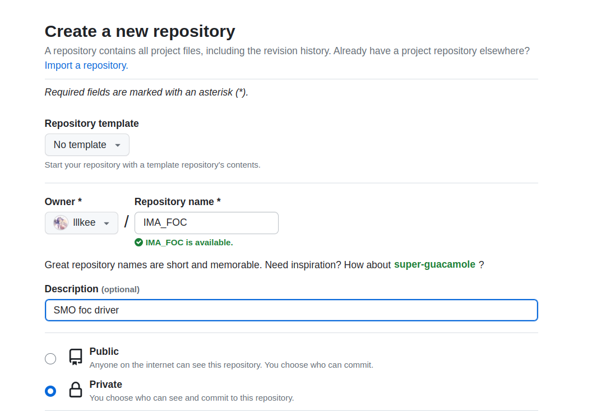
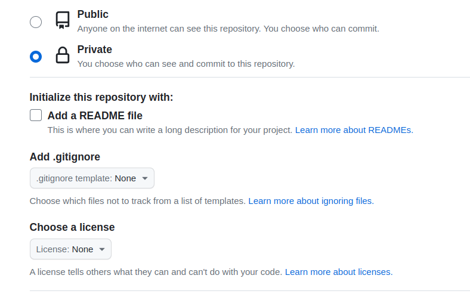
复制该ssh地址
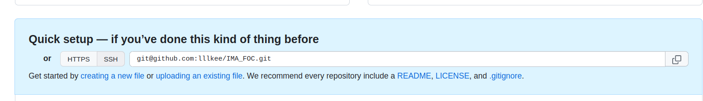

在文件夹中打开终端进行git的初始化和本地文件管理
添加远程仓库

```bash
git remote add 项目名字 项目ssh链接
```

确认本地仓库无误后

```bash
git push 项目名字 分支
```

### git_clone

复制链接后在文件夹打开终端输入

```bash
git clone ssh地址 
```

在修改完文件commit后要pull一次，防止master分支已被修改而造成冲突，pull后有冲突处理方法和上面merge一样

```bash
git pull
git push origin master  
#从远程仓库拉下的项目名字为origin
```

如果想要强制覆盖则在push后加 --force（不推荐使用）

### release

相关的编译后的固件和二进制文件可发布在release上
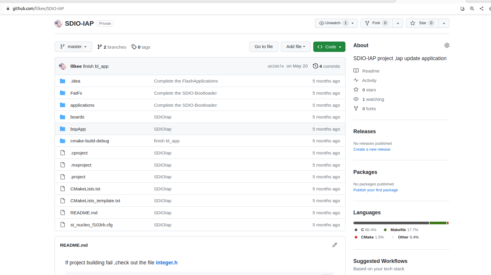
右侧<font color=blue>Create a new release</font>

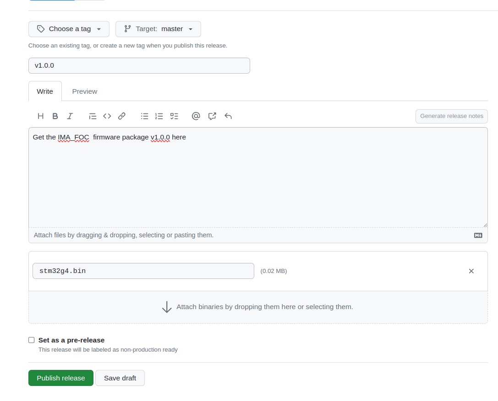
填完信息后在下方添加附件就可以发布了

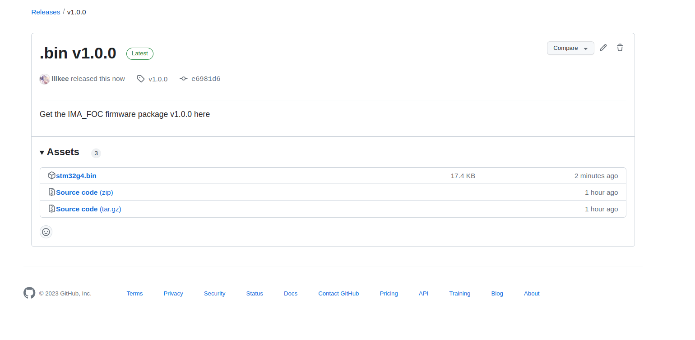

