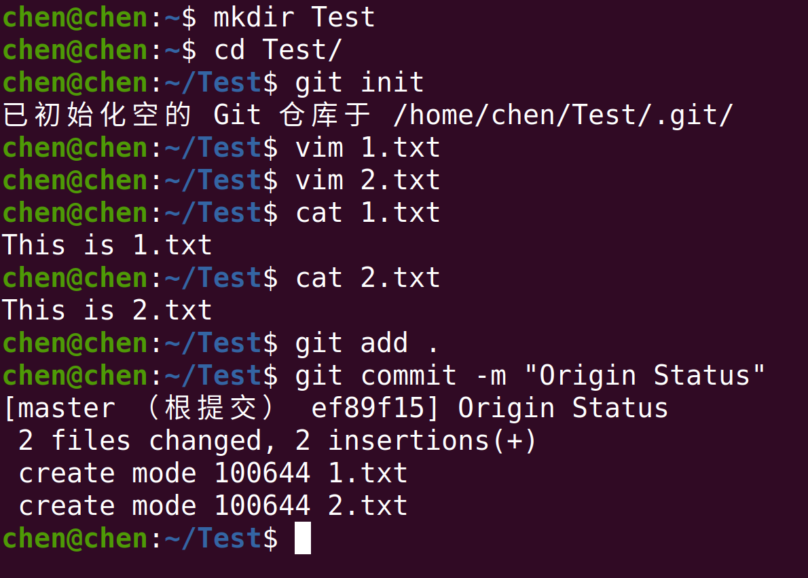
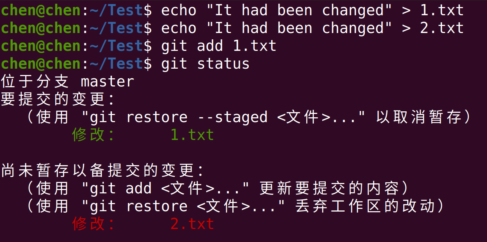
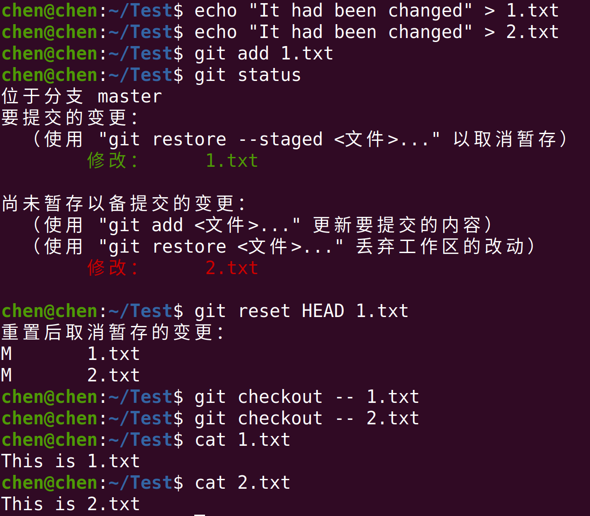
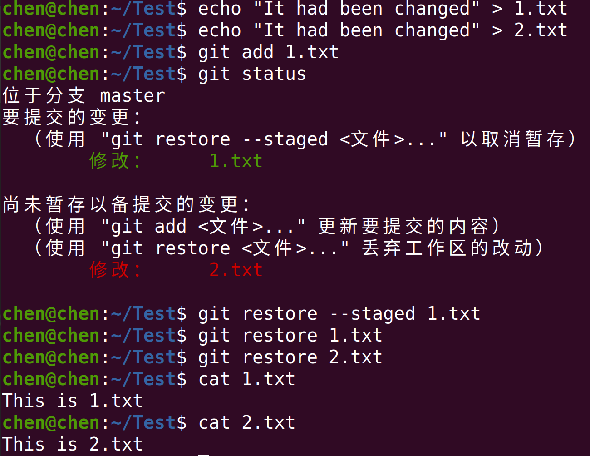
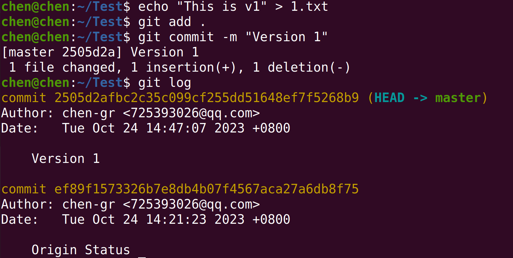
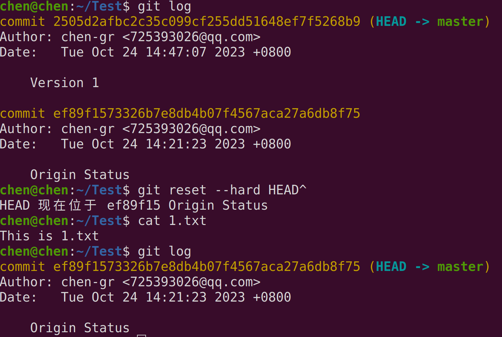
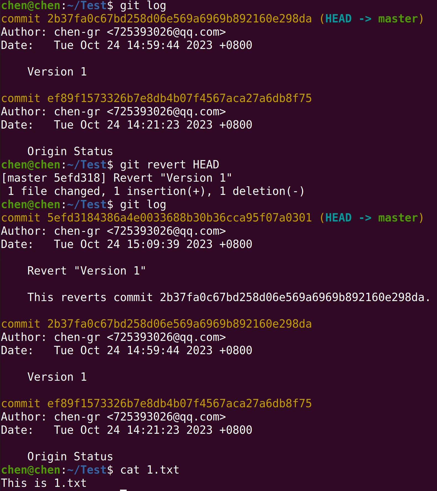
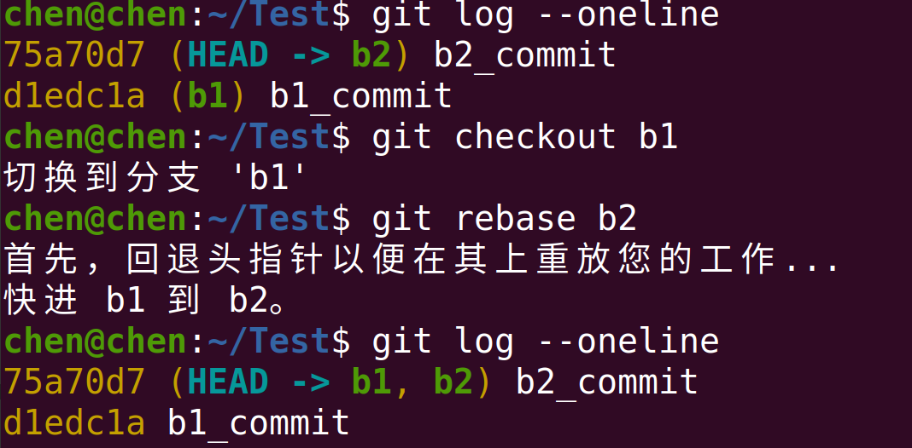
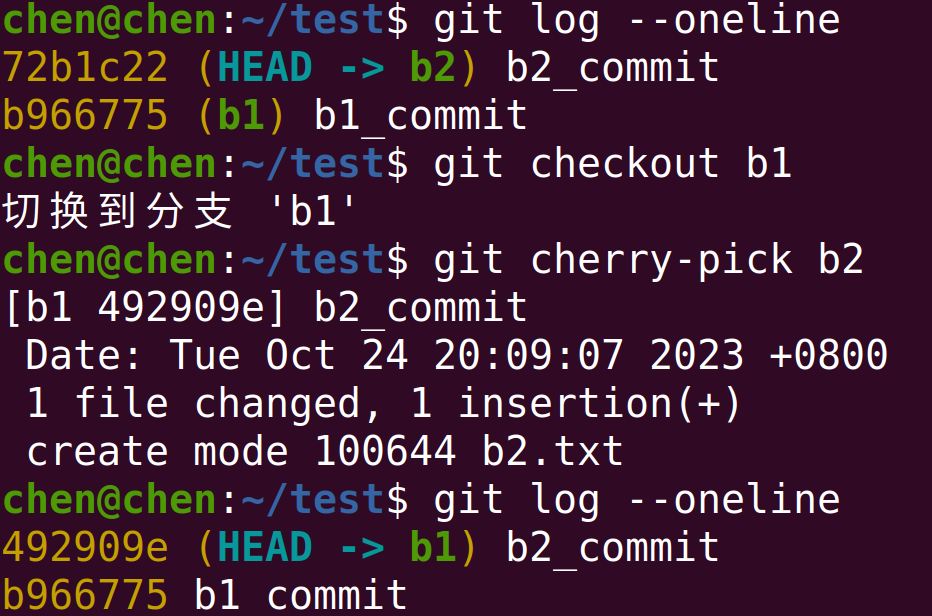

# Question 1

首先先在本地建立一个仓库用于测试

对1.txt、2.txt进行修改，将1.txt添加到暂存区

## solution 1

使用`git reset HEAD filename`将文件回退到工作区，随后使用`git checkout -- filename`将修改回退到最后一次提交的版本

## solution 2

使用`git restore --staged filename`将文件回退到工作区，随后使用`git restore filename`将修改回退到最后一次提交的版本

# Question 2

首先创建两个版本

## solution 1(修改历史)

使用`git reset --hard HEAD^`回退到上一版本

## solution 2（不修改历史）

使用`git revert`取之前的版本号进行回退，同时保留修改历史

# Question 3

## solution 1

使用`git rebase` 合并分支

## solution 2

使用`git cherry-pick`合并分支

