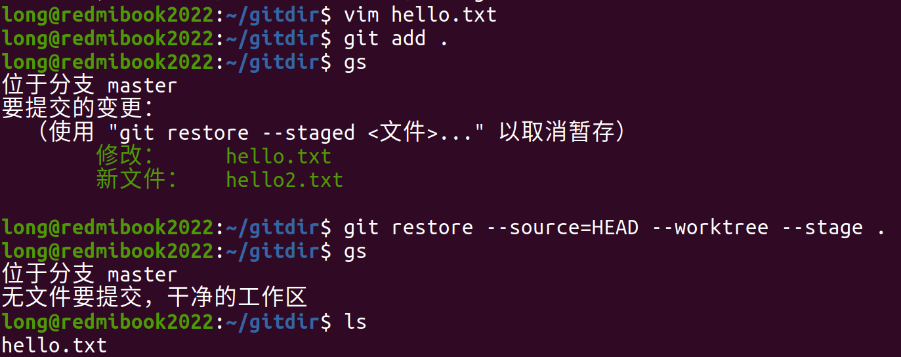
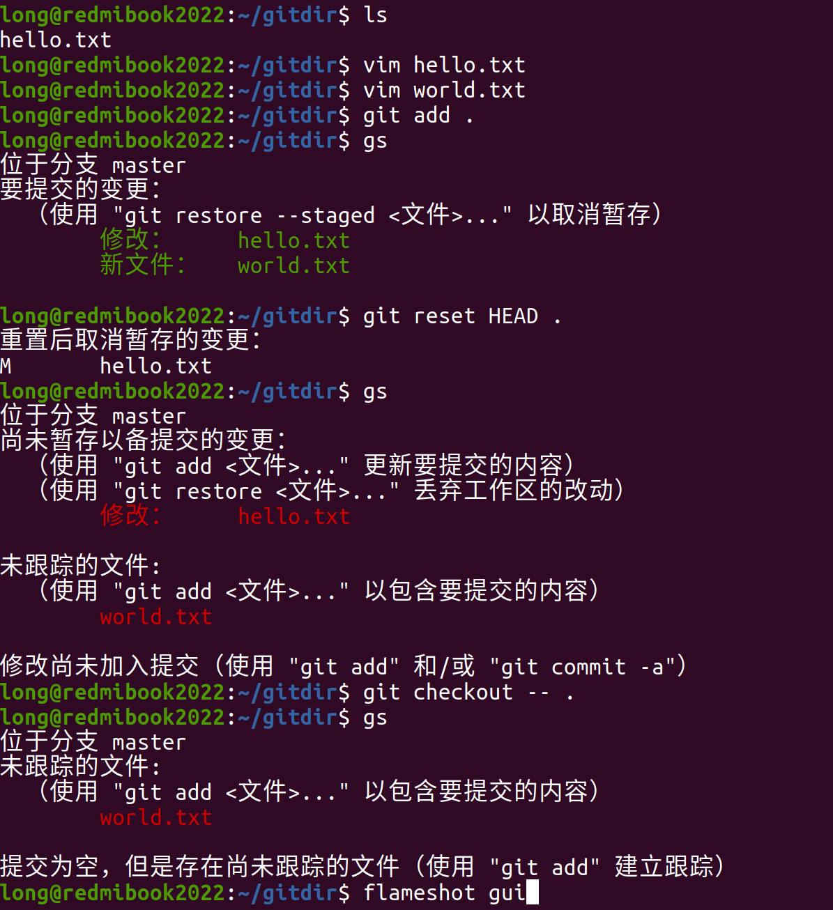
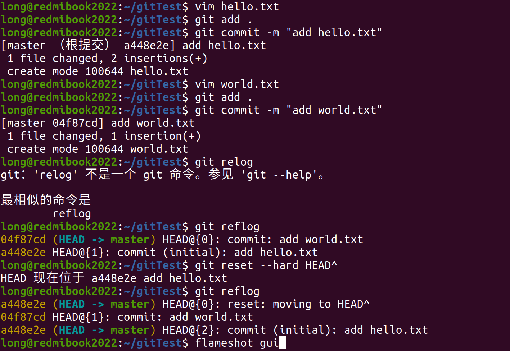
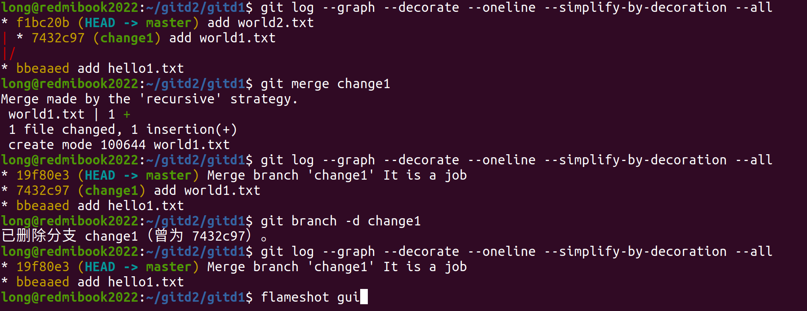
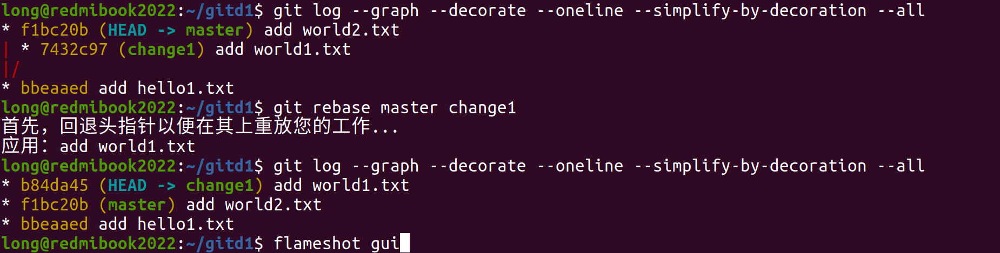

# Git Answer
## answer 1
1. way1
> git restore --source==HEAD --stage --worktree file1 file2 ...
> 
1. way2
> git reset HEAD .  
> git checkout -- .
> 

## answer 2
1. way1
> git reset --hard HEAD^  
>   

2. way2
> git revert HEAD
>  

## answer 3
1. way1
> git revert HEAD
> 

1. way2
> git rebase master change1   
> 或git checkout change1    
> git rebase master
> 

